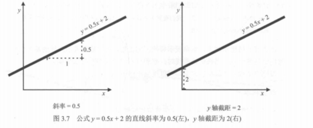
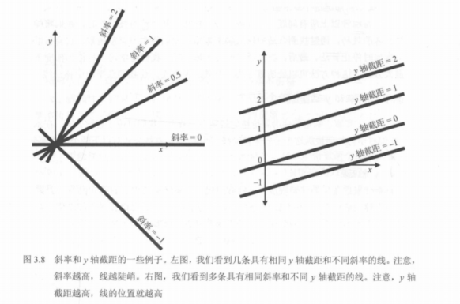
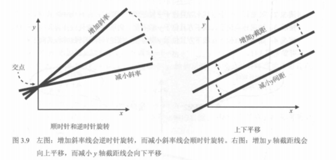
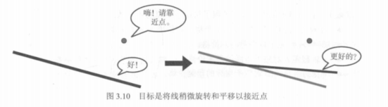
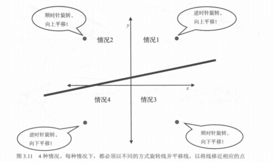

# 01. 例子

线性回归的典型示例：**预测房屋价格**。

## 表 3.1：简化数据

| 房间数 | 价格/万美元 |
|--------|------------|
| 1 | 15 |
| 2 | 20 |
| 3 | 25 |
| 4 | ?（待预测） |
| 5 | 35 |
| 6 | 40 |
| 7 | 45 |

规律：每增加 1 个房间，价格约增 5 万。

## 表 3.2：稍复杂数据

| 房间数 | 价格/万美元 |
|--------|------------|
| 1 | 15.5 |
| 2 | 19.7 |
| 3 | 24.4 |
| 4 | **?**（待预测） |
| 5 | 35.6 |
| 6 | 40.7 |
| 7 | 44.8 |

## 模型公式

价格 = 10 + 5 × 房间数

- 偏差 b = 10（基础价格）
- 权重 w = 5（每间房增量）

## 预测示例

- 4 个房间：10 + 5×4 = 30 万
- 3 个房间：10 + 5×3 = 25 万

---

## 快速了解斜率和 y 轴截距

要「在平面中移动这条线」，先弄清直线由哪两件事决定。

### 线性方程的两部分

- **斜率**：直线的**陡峭程度** = 上升距离 ÷ 向右移动的距离（rise / run）
- **y 轴截距**：直线与**纵轴（y 轴）的交点**，表示直线的**位置**

### 例子：y = 0.5x + 2

- **斜率 = 0.5**：沿直线向右走 1 单位，向上走 0.5 单位
- **y 轴截距 = 2**：直线与 y 轴交于高度 2

补充：斜率为 0 表示不上升；斜率为负表示向下；竖直线斜率不存在（线性回归中一般不出现）。**确定斜率和 y 轴截距，就唯一确定一条直线**：斜率决定**方向**，截距决定**位置**。

（图 3.7：左图示意斜率 0.5，右图示意 y 轴截距 2。）

### 图 3.8：斜率和截距的例子

- **左图**：y 轴截距相同（都为 0），斜率不同（2、1、0.5、0、-1）。斜率越大，直线越陡。
- **右图**：斜率相同，y 轴截距不同（2、1、0、-1）。截距越大，直线位置越高。

### 在房价模型中的对应

- **斜率** = 每间房的价格（权重 m）
- **y 轴截距** = 房屋的基本价格（偏差 b）

移动直线时，可联想这对房价模型的影响。

### 改变斜率会怎样

- **斜率增大** → 直线绕与 y 轴的交点**逆时针**旋转
- **斜率减小** → 直线绕与 y 轴的交点**顺时针**旋转

### 改变 y 轴截距会怎样

- **y 轴截距增大** → 直线**向上**平移
- **y 轴截距减小** → 直线**向下**平移

图 3.9 左图体现斜率的旋转，右图体现截距的上下平移；调整线性回归模型时会用到这两种变化。

### 直线公式与本章符号

一般直线公式：y = mx + b（x、y 为横纵坐标，m 为斜率，b 为 y 轴截距）。

本章为与房价符号一致，写成 **p̂ = mr + b**：p̂ 为预测价格，r 为房间数，m（斜率）为每间房价格，b（y 轴截距）为房屋基本价格。

---

## 将线移近一个点的简单技巧（图 3.10、3.11）

线性回归里会反复做一件事：**把直线稍微旋转、平移**，使其更靠近当前选中的那个点。目标就是「一次移近一个点」。

### 平移规则

- 点在直线**上方** → 直线**向上**平移（增大 b）
- 点在直线**下方** → 直线**向下**平移（减小 b）

### 旋转规则（绕直线与 y 轴的交点）

- **逆时针**旋转：点在「直线上方且 y 轴右侧」或「直线下方且 y 轴左侧」
- **顺时针**旋转：点在「直线上方且 y 轴左侧」或「直线下方且 y 轴右侧」

### 四种情况小结（图 3.11）

| 情况 | 点相对直线与 y 轴 | 操作 |
|------|-------------------|------|
| 情况 1 | 直线上方、y 轴右侧 | 逆时针旋转 + 向上平移 |
| 情况 2 | 直线上方、y 轴左侧 | 顺时针旋转 + 向上平移 |
| 情况 3 | 直线下方、y 轴右侧 | 顺时针旋转 + 向下平移 |
| 情况 4 | 直线下方、y 轴左侧 | 逆时针旋转 + 向下平移 |

图 3.10：目标是把线稍作旋转和平移以靠近点。图 3.11：四种情况，每种都要用对应的旋转+平移把线移近该点。

### 符号约定（本节）

- 点坐标为 **(r, p)**：r 为房间数，p 为真实价格
- 直线公式 **p̂ = mr + b**：m 为斜率（每间房价格），b 为 y 轴截距（房屋基本价格）
- p̂ 为模型对该点的预测价格

### 简单技巧的伪代码

**输入**：点 (r, p)，当前直线斜率为 m、y 轴截距为 b（公式 p̂ = mr + b）

**输出**：新直线 p̂ = m'r + b'，更接近该点

**过程**：
1. 取两个很小的正数，记为 η₁、η₂（希腊字母 eta）
2. 按点的位置选一种情况，更新 m 和 b：

| 情况 | 条件 | 更新 |
|------|------|------|
| 1 | 点在上方、y 轴右侧 | m' = m + η₁，b' = b + η₂ |
| 2 | 点在上方、y 轴左侧 | m' = m − η₁，b' = b + η₂ |
| 3 | 点在下方、y 轴右侧 | m' = m − η₁，b' = b − η₂ |
| 4 | 点在下方、y 轴左侧 | m' = m + η₁，b' = b − η₂ |

3. 返回新直线 p̂ = m'r + b'

**注意**：在房价例子里，横坐标 r（房间数）不会为负，所以只会出现**情况 1**（点在上方、右侧）和**情况 3**（点在下方、右侧）；斜率加减 η₁ 相当于调整「每间房价格」，截距加减 η₂ 相当于调整「基本价格」。

---

## 绝对技巧（Absolute Trick）

平方技巧很有效，但**绝对技巧**也很有用，可以看作介于**简单技巧**与**平方技巧**之间：平方技巧用 **(p − p̂)** 和 **r** 把四种情况合并成一种；绝对技巧只用 **r** 把四种情况简化为**两种**（点在线上方 / 线下方）。

### 绝对技巧的伪代码

**输入**：
- **直线**：斜率为 m、y 轴截距为 b，公式 p̂ = mr + b
- **点**：数据点坐标 (r, p)
- **学习率**：小正数 η

**输出**：新直线 p̂ = m'r + b'，更接近该点

**过程**：

- **情况 1：点在线上方**（p > p̂）
  - **改斜率**：m' = m + ηr  
    - 若点在 y 轴右侧（r > 0），直线**逆时针**旋转；若在左侧（r < 0），**顺时针**旋转
  - **改截距**：b' = b + η → 直线**向上**平移

- **情况 2：点在线下方**（p < p̂）
  - **改斜率**：m' = m − ηr  
    - 若点在 y 轴右侧（r > 0），直线**顺时针**旋转；若在左侧（r < 0），**逆时针**旋转
  - **改截距**：b' = b − η → 直线**向下**平移

**返回**：新直线 p̂ = m'r + b'

---

## 平方技巧（Squared Trick）

把「四种情况」统一成一种更简洁的写法：用**误差 (p − p̂)** 和**学习率 η** 直接更新斜率和截距，线总会朝该点靠近。

### 截距的更新

- **观察 1**：点在上方 → 给 b 加一点；点在下方 → 给 b 减一点。
- **观察 2**：点在上方时 **p − p̂ > 0**，在下方时 **p − p̂ < 0**（图 3.12）。
- 因此：给 b 加上 **(p − p̂)**，方向就对；为控制步长，乘一个很小的数 **η（学习率）**，即用 **η(p − p̂)** 加在 b 上。

**学习率 η**：训练前选好的小数，保证每次只改一点点。

### 斜率的更新

- **观察 3**：情况 1、4 为逆时针（斜率增大），情况 2、3 为顺时针（斜率减小）。
- **观察 4**：点在 y 轴右侧则 r > 0，左侧则 r < 0；房价例子里 r（房间数）≥ 0。**r(p − p̂)** 在情况 1、4 为正，在情况 2、3 为负（图 3.13）。
- 因此：给 m 加上 **η·r(p − p̂)**，线会朝该点旋转。

### 平方技巧的伪代码

**输入**：直线 (m, b)，公式 p̂ = mr + b；数据点 (r, p)；学习率 η（小正数）

**输出**：新直线 p̂ = m'r + b'，更接近点 (r, p)

**过程**：
- **旋转线（改斜率）**：m' = m + η·r·(p − p̂)
- **平移线（改截距）**：b' = b + η·(p − p̂)
- 返回新直线 p̂ = m'r + b'

---

## 变量定义与迭代改进

### 符号说明

| 符号 | 含义 |
|------|------|
| p | 数据集中的真实房价 |
| p̂ | 模型预测的房价（̂ 表示预测值） |
| r | 房间数量 |
| m | 每间房的价格（权重） |
| b | 房屋的基本价格（偏差） |

### 公式

预测价格 = 每间房的价格 × 房间数 + 房屋的基本价格

即：p̂ = m·r + b

### 数值例子：迭代改进

**初始模型**：每间房 4 万，基础价 5 万 → p̂ = 4r + 5（单位：万美元）

**数据点**：某房屋 2 个房间，真实价格 15 万（p=15）

**预测**：p̂ = 5 + 4×2 = 13 万 → 偏低

**改进**：预测偏低，说明 m 或 b 偏小。将 m 增 0.05（4→4.05），b 增 0.1（5→5.1）

**新模型**：p̂ = 4.05r + 5.1

**新预测**：p̂ = 4.05×2 + 5.1 = 13.2 万 → 更接近 15 万

> 这里只是对**该点**更好，对其它点是否更好尚不确定；线性回归就是反复做这类改进。

---

## 3.3 如何让计算机绘制出这条线：线性回归算法

**问题**：如何让计算机绘制出一条非常靠近这些点的线？

**思路**：一步一步改进，类似机器学习常见做法。

1. 从一条**随机线**开始
2. 在数据集中**选一个随机点**
3. **把线稍微移近该点**
4. **多次重复**步骤 2、3，每次随机选点
5. 重复足够多次后，得到的线会靠近所有点

过程听起来有些笨拙，但**确实实用**，这就是**线性回归算法**。

### 伪代码（几何视角）

**输入**：平面中点的数据集

**输出**：靠近点的线

**过程**：
- 随机选择一条线
- 将下面两步重复多次：
  - 选择一个随机数据点
  - 将线移近该数据点
- 返回得到的线

### 伪代码（参数视角）

**输入**：点数据集

**输出**：适合该数据集的线性回归模型

**过程**：
1. 选择一个具有**随机权重**和**随机偏差**的模型
2. 将下面两步重复多次：
   - 选择一个随机数据点
   - **稍微调整权重和偏差**，以改进对该数据点的预测
3. 返回得到的模型

### 线性回归算法的伪代码（形式化）

**输入**：房屋数据集（房间数、价格）

**输出**：模型权重——**每个房间的价格**（斜率）、**基本价格**（y 轴截距）

**过程**：
1. 从**斜率和 y 轴截距的随机值**开始。
2. 将下面两个步骤**重复多次**：
   - 选择一个随机数据点；
   - 使用**绝对技巧**或**平方技巧**更新斜率和 y 轴截距。
3. 返回得到的斜率和截距（即模型权重）。

**说明**：循环的每次迭代称为**一次迭代周期**，迭代次数在算法开始时设定。简单技巧多用于说明，但如前所述效果不佳；在实战中常用**绝对技巧**或**平方技巧**，效果更好。两者都常用，但**平方技巧更受欢迎**，因此算法中通常采用平方技巧，若需要也可选用绝对技巧。

### 你可能有几个问题

- 权重（和偏差）**应该调整多少**？
- 该算法**应该重复多少次**？即：何时结束？
- **如何知道这个算法有效**？

本章将回答以上问题：介绍**平方技巧**与**绝对技巧**（如何调整权重）、**误差函数**（何时停止）、**梯度下降**（为何有效）。首先从「在平面中移动这条线」开始。

- 详见本目录：`02.损失函数.md`（误差、何时停）、`03.梯度下降.md`（如何更新参数、为何有效）。

---

## 通用线性回归算法（选读）

本节为选读，侧重多特征情形下的通用写法，便于与多数机器学习教材的符号一致。

前文以**单特征**（如仅「房间数」）为例；实际数据常有**多个特征**，需要通用算法。通用算法与前述单特征算法差别不大：每个特征的更新方式，等同于单特征时对**斜率**的更新；房价例子里只有「一个斜率 + 一个截距」，通用情形下是 **n 个权重（斜率推广）+ 一个偏差（截距）**。

### 符号约定

- 数据集：**m** 个样本、**n** 个特征。
- 模型：**n** 个权重 w₁,…,wₙ（可视为多个「斜率」）、**1** 个偏差 b。
- 样本记为 x⁽¹⁾, x⁽²⁾, …, x⁽ᵐ⁾；每个样本 x⁽ⁱ⁾ 是 n 维向量：x⁽ⁱ⁾ = (x₁⁽ⁱ⁾, x₂⁽ⁱ⁾, …, xₙ⁽ⁱ⁾)。
- 标签：y₁, y₂, …, yₘ。
- 预测：ŷ = w₁x₁ + w₂x₂ + … + wₙxₙ + b。

### 通用平方技巧的伪代码

**输入**：模型 ŷ = w₁x₁ + w₂x₂ + … + wₙxₙ + b；一个数据点 (x, y)；学习率 η（小正数）。

**输出**：更新后的模型 ŷ = w'₁x₁ + w'₂x₂ + … + w'ₙxₙ + b'，更接近该点。

**过程**：
- **更新偏差**：b' = b + η(y − ŷ)
- **更新每个权重**：对 i = 1, 2, …, n，令 w'ᵢ = wᵢ + η·xᵢ·(y − ŷ)

**返回**：新模型 ŷ = w'₁x₁ + … + w'ₙxₙ + b'。

通用线性回归算法的整体伪代码与前面「线性回归算法的伪代码」相同，只是把单次更新换成上述**通用平方技巧**，故此处不再重复列出。
