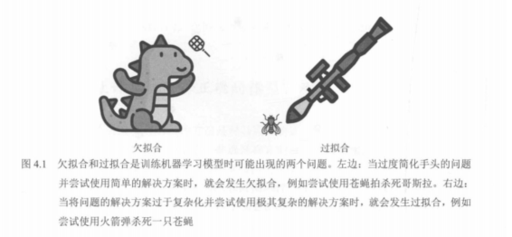
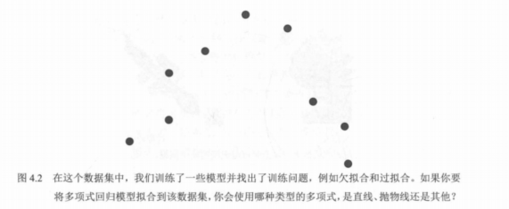
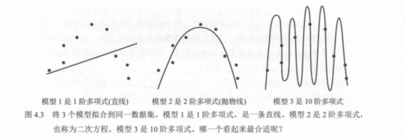

# 01. 欠拟合与过拟合

本章与介绍具体机器学习算法不同，重点讨论模型训练时常遇到的**问题**以及**实用解决办法**。很多情况下，数据科学家用「很好的」算法做出了模型，上线后却表现不佳——这类情况很常见，本章就围绕如何发现和缓解这类问题展开。

## 两类常见问题

训练过程中最常出现的两个问题是：

- **欠拟合（underfitting）**：模型过于简单，没有学到数据中的规律，表现差。
- **过拟合（overfitting）**：模型过于复杂，相当于把训练数据「背下来」，在未见过的数据上预测会很差。

本章将围绕这两个问题，介绍以下解决思路：

1. **测试和验证**：用独立数据评估模型，避免只看训练表现。
2. **模型复杂度图**：观察误差随模型复杂度的变化，找到合适复杂度。
3. **正则化**：在损失中加入惩罚项，限制模型复杂度，减轻过拟合。

---

## 用「考试」来理解

- **欠拟合**：像**复习不够**就去考试——模型太简单，没学好规律，成绩差。
- **过拟合**：像**把整本教材一字不差背下来却不理解**——模型太复杂，只是记住了训练集，遇到新题就糟。
- **理想情况**：像**复习得刚刚好**——既理解规律，又能泛化到新题；模型复杂度适中，在训练集和未见数据上都能有较好表现。

---

## 用「任务与工具」来理解

也可以把欠拟合和过拟合看成做任务时的两种错误：**把问题想得太简单**，或**把解法搞得太复杂**。

### 欠拟合：问题复杂，工具太简单（图 4.1）

任务如果是「消灭哥斯拉」（复杂问题），却只带了一把**苍蝇拍**（过于简单的工具），相当于低估了问题难度。对应到建模：数据本身很复杂，却用了过于简单的模型（如一条直线拟合明显非线性的关系），模型无法刻画数据中的结构，就会**欠拟合**。

### 过拟合：问题简单，工具过于复杂

任务如果是「打一只苍蝇」（简单问题），却动用了**火箭筒**（过于复杂的工具）。苍蝇可能被打中了，但周围一片狼藉，自己也身处险境。对应到建模：数据规律本来不复杂，却用了非常复杂的模型（如高阶多项式、很多参数），模型把训练样本甚至噪声都「背」下来了，在训练集上误差很小，但在**新数据上预测会很差**——这就是**过拟合**。

---

## 4.1 使用多项式回归的欠拟合和过拟合示例

下面用**同一份数据**，通过**多项式回归**来直观看到欠拟合和过拟合的区别。

**图 4.2** 给出一组散点：整体呈**开口向下的抛物线**趋势（像一张「哭脸」），并带有一定波动（噪声）。若要把多项式回归拟合到该数据集，你会选哪种多项式——直线、抛物线、三次曲线，还是 100 阶？人眼一看就能判断「抛物线最合适」（即 2 阶），但**计算机没有这种视觉直觉**，只能**逐一尝试不同阶数**，再通过某种方法（如验证误差、模型复杂度图）选出拟合最好的那一档；例如先试 1 阶（直线）、2 阶（抛物线）、10 阶（最多 9 次振荡的曲线），得到的结果就是图 4.3 中的三个模型。

**多项式的阶（order）**：指多项式中**最高次项的次数**。例如 2x¹⁴ + 9x⁶ − 3x + 2 的阶为 14。

**图 4.2 图注**：在这个数据集中，我们训练了一些模型并找出了训练问题（例如欠拟合和过拟合）。若要将多项式回归拟合到该数据集，你会使用哪种类型的多项式——直线、抛物线还是其他？图中散点从左到右先升后降，呈弧形分布。

**图 4.3** 把三个模型拟合到同一数据集上；图注问：**哪一个看起来最合适？**

| 模型   | 多项式阶数     | 形状       | 对应现象   |
|--------|----------------|------------|------------|
| 模型 1 | 1 阶（直线）   | 一条直线   | **欠拟合** |
| 模型 2 | 2 阶（抛物线） | 二次曲线   | **合适拟合** |
| 模型 3 | 10 阶          | 曲折多峰   | **过拟合** |

图 4.3 中从左到右：模型 1 为 1 阶多项式（直线）；模型 2 为 2 阶多项式（抛物线，也称二次方程）；模型 3 为 10 阶多项式（曲线多弯、几乎穿过每一点）。

- **模型 1**：用**直线**去拟合明显弯曲的数据，模型**过于简单**；直线无法充分拟合这份呈抛物线形态的数据集，无法刻画「先升后降」的趋势，误差大 → **欠拟合**。
- **模型 2**：抛物线与数据的整体走向一致，既跟上主趋势，又不会紧贴每一个点 → **最合适**。
- **模型 3**：10 阶多项式几乎穿过所有训练点，训练误差很小，但在点与点之间剧烈震荡，把噪声也学进去了，在新数据上往往表现很差 → **过拟合**。

所以：**哪一个看起来最合适？** 答案是模型 2（2 阶抛物线）。后续将用**测试与验证**和**模型复杂度图**来定量地做这种选择。

**小结三个模型的拟合表现**：数据整体**不像直线**，而像**带噪声的抛物线**。模型 1 明显**欠拟合**；相比之下，模型 2 **比较适合数据**，既不过拟合也不欠拟合，能捕捉数据本质；模型 3 **非常贴近每个点**，但画的是非常复杂的 10 阶多项式，试图靠近每一个点却没有捕捉到数据的本质（那条光滑的抛物线），是**过拟合的明显例子**。非常简单的模型往往欠拟合，非常复杂的模型往往过拟合；我们的目标是找到一个**既不太简单也不太复杂**的模型，能很好地捕捉数据的本质。

---

## 人眼与计算机：单看训练误差会选错模型

**人眼**可以直观判断：模型 2 给出了最佳拟合。

**计算机**只能依据**误差函数**做判断。第 3 章定义过两种误差：**绝对误差**和**平方误差**。为表述清晰，本例用**绝对误差**：各点到曲线的距离取绝对值后求和，再取**平均**（即平均绝对误差）；若改用平方误差，逻辑相同。

- **模型 1**：点离模型很远 → **误差很大**。
- **模型 2**：点到曲线的距离较短 → **误差较小**。
- **模型 3**：曲线几乎穿过每一个点 → 点到曲线的距离为 **0**，训练误差最小！

若计算机**只最小化训练集上的误差**，会认为「完美模型」是模型 3，而不是我们想要的模型 2。**情况不妙**。因此需要一种方法，让计算机知道**最好的模型是**能够泛化到新数据的那个——这正是后续**测试与验证**、**模型复杂度图**和**正则化**要解决的问题。

---

## 小结

| 现象     | 原因           | 直观类比           |
|----------|----------------|--------------------|
| 欠拟合   | 模型太简单     | 复习不够 / 苍蝇拍打哥斯拉 |
| 过拟合   | 模型太复杂     | 死记硬背 / 用火箭筒打苍蝇 |
| 合适拟合 | 复杂度适中     | 理解规律、能泛化   |

后续小节将介绍：如何通过**测试与验证**发现过拟合、如何用**模型复杂度图**选模型、以及如何用**正则化**控制复杂度。
