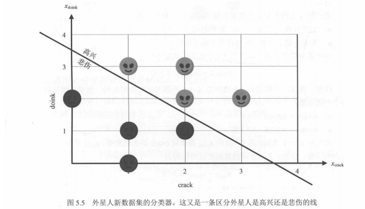
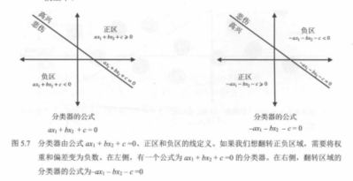
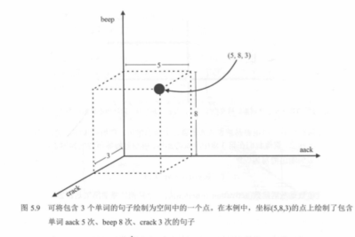
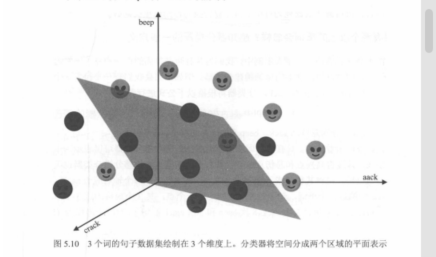

# 02. 情感分析

情感分析是**文本分类**的一种：根据一句话（或一段话）的内容，判断其情感是**正面**（如开心、满意）还是**负面**（如难过、不满）。本章把它作为感知器的主例，说明如何用「一条线」把不同情感的句子在特征空间里**划分开**。

---

## 5.1 问题：我们在一个外星球上，听不懂外星人的语言

想象这样一个场景：我们是宇航员，刚刚降落在一个遥远的星球上，那里住着一群未知的外星人。我们想和他们交流，但他们说着一种我们听不懂的语言。

我们注意到外星人主要有两种情绪：**高兴**和**悲伤**。为了迈出沟通的第一步，我们希望只根据他们说的话，判断他们现在是高兴还是悲伤。换句话说，我们要构建一个**情感分析分类器**。

---

## 数据集（玩具例子）

我们先观察了 4 个外星人（其中 2 个高兴、2 个悲伤），他们总是重复很少的词。假设他们的语言里几乎只有两个词：

- `aack`
- `beep`

我们记录他们说的话，并标注情绪，形成训练数据：

- **外星人 1**：情绪 = 高兴，句子 = `"aack, aack, aack!"`
- **外星人 2**：情绪 = 悲伤，句子 = `"beep beep!"`
- **外星人 3**：情绪 = 高兴，句子 = `"aack beep aack!"`
- **外星人 4**：情绪 = 悲伤，句子 = `"aack beep beep beep!"`

突然，第 5 个外星人走进来，说：

- **外星人 5（待预测）**：句子 = `"aack beep aack aack!"`

我们需要预测：这个外星人是高兴还是悲伤？

---

## 问题形式化

- **输入**：一句话（或一个文本片段）。
- **输出**：一个**类别**，例如「开心」或「难过」（二分类）；也可扩展为多档，如非常正面 / 正面 / 中性 / 负面 / 非常负面。
- **训练数据**：大量已标注的句子，每条带有真实情感标签。模型从这些样本中学习「什么样的表达对应哪种情感」。

---

## 从句子到特征

机器不能直接处理文字，需要先把句子变成**数值特征**，才能交给分类器（如感知器）计算。常见做法包括：

- **词袋（bag of words）**：统计句中是否出现或出现多少次某些词（如「棒」「开心」「糟糕」「难过」），每个词对应一个特征维度。
- **n-gram**：把连续的几个字或词当作一个单位，统计出现情况，增加特征。
- **情感词典**：用预定义的正面/负面词表，对句子打分（如正面积分减负面积分），得到一个或几个数值特征。

本章为突出「用线划分点」的直观，会假设每条句子已经被表示成**有限个数值特征**（例如两个特征 x₁、x₂）；在二维平面上，每个句子对应一个点，不同情感对应不同类别的点。**感知器的目标**就是学出一条直线（高维时是超平面），把「开心」和「难过」两边的点尽可能分开。

---

## 把外星人句子变成 2 维特征

在这个玩具例子里，我们可以直接用两个特征表示一句话：

- x₁ = `aack` 出现次数
- x₂ = `beep` 出现次数

这样每个句子就会变成平面上的一个点 (x₁, x₂)。例如：

- `"aack, aack, aack!"` → (3, 0)
- `"beep beep!"` → (0, 2)
- `"aack beep aack!"` → (2, 1)
- `"aack beep beep beep!"` → (1, 3)
- `"aack beep aack aack!"` → (3, 1)

接下来，我们就可以用感知器学出一条直线，把「高兴」点与「悲伤」点尽量分开，并对第 5 个外星人的点做分类预测。

---

## 一个最简单的分类器：给词打分，然后把分数加起来

先从一个“很朴素但能跑起来”的分类器开始：给每个词一个分数，再把句子里的词分数加总。

**打分规则（示例）**：

- `aack`：+1 分
- `beep`：−1 分

**预测规则**：

- 句子总分 > 0 → 预测为 **Happy（高兴）**
- 句子总分 < 0 → 预测为 **Sad（悲伤）**

（边界情况：总分 = 0 时怎么判都行；在真实任务中这种“刚好卡边界”的情况通常很少，或者会用更稳的方式处理。）

### “看点在直线哪边”和“算分数正负”是一回事

如果把特征记作：

- x1 = #aack
- x2 = #beep

那么这套打分规则算出来的总分就是：

- score = x1 - x2 = #aack - #beep

于是：

- score > 0 ⇔ x1 > x2：点落在分界线的一侧 → **Happy**
- score < 0 ⇔ x1 < x2：点落在另一侧 → **Sad**
- score = 0 ⇔ x1 = x2：刚好在分界线上

所以并不是“先有一条线，再去算分数”；而是**先有线性打分（线性组合），分界线就是把 score 设为 0 得到的几何表达**。

之所以强调“算分数”，是因为图是给人直观理解用的；而在感知器/线性分类器里，机器真正执行的是更通用的形式 `score = w·x + b`，看 `score` 的符号来分类（特征变多时就画不出图了，但这条规则仍然成立）。

---

## 表 5.1：把句子变成“出现次数表”

把每句话中 `aack` 与 `beep` 的出现次数数出来，就得到一个非常清晰的训练集表示：

| 句子 | #aack | #beep | 情绪 |
|---|---:|---:|---|
| aack aack aack! | 3 | 0 | Happy |
| beep beep! | 0 | 2 | Sad |
| aack beep aack! | 2 | 1 | Happy |
| aack beep beep beep! | 1 | 3 | Sad |

在这张表里，一条句子就是一个点 (x_aack, x_beep)。

---

## 图 5.2：把训练集画成平面上的点

我们把：

- 横轴：`aack` 出现次数（x_aack）
- 纵轴：`beep` 出现次数（x_beep）

就能把 4 个外星人的句子画成二维平面上的 4 个点。

---

## 一条最自然的分界线：#aack = #beep

使用上面的打分规则（aack +1、beep −1）时，句子总分就是：

- 总分 = (#aack) − (#beep)

因此“分界线”就是总分为 0 的位置：

- #aack − #beep = 0
- 也就是：#aack = #beep

**两侧区域的含义**：

- **正区（Happy）**：#aack − #beep > 0，也就是 #aack > #beep
- **负区（Sad）**：#aack − #beep < 0，也就是 #aack < #beep

你可以把它理解成：当一句话里 `aack` 更多时，更可能是高兴；当 `beep` 更多时，更可能是悲伤。

---

## 更复杂一点：新星球上的 crack / doink（阈值与偏差）

当语言更复杂时，我们可能需要：

- 不同词有不同权重（不再只是 +1 / −1）
- 以及一个“阈值/偏差”（不一定把分界线固定在 0）

书中给了一个更复杂的玩具例子：把句子里 `crack` 与 `doink` 的出现次数当作两个特征，数据点分布更复杂，需要选择一个更合适的分界线与阈值。

在这种情况下，你可以把分类器写成更通用的形式：

- 总分 = w_crack × (#crack) + w_doink × (#doink) + b
- 总分 >= 0 → Happy
- 总分 < 0 → Sad

其中：

- w_crack、w_doink 是权重
- b 是偏差（bias），相当于把分界线整体平移

### 常见疑问：为什么前面权重刚好是 1？

在 `aack / beep` 那个最简单的例子里，我们的规则是：

- `aack` 记 +1 分
- `beep` 记 −1 分
- score > 0 判 Happy，score < 0 判 Sad

把它写成“线性打分”的样子，本质就是：

- score = 1 × (#aack) + (−1) × (#beep) + 0

所以你会看到：

- `aack` 的权重是 +1
- `beep` 的权重是 −1

这里“1”并没有什么神秘的：**它是人为了演示方便，先拍一个最简单的规则**，不是训练出来的结果。你把它们整体放大成 +2 和 −2，甚至 +10 和 −10，判断边界都不会变（因为只看正负，不看绝对大小）。

### 多个词/多个特征时，权重是不是要不断修正？

是的，这个直觉非常准：当特征不止两个词时，每个特征都会有一个权重，模型会根据训练数据去“学”这些权重，让分类越来越准。

可以把它想成：

- 一开始：给每个词随便一个权重（例如全 0、全 1 或随机）
- 用当前权重去算 score 并做分类
- 预测错了：就调整权重（帮助判断的特征权重变大；起反作用的变小，甚至变成负）
- 反复迭代：直到大部分样本都能分对（或误差足够小）

这和线性回归“根据误差不断更新权重”的思想非常像；区别主要在于：回归输出连续数值，而感知机/线性分类器最终只关心 score 的符号来决定类别。

### 阈值 threshold 和偏差 bias：只是两种等价写法

很多教材会把规则写成“分数要超过某个阈值才算正类”，例如：

- 如果 score >= 3.5 → Happy
- 否则 → Sad

这和我们写的 `score = w·x + b` 完全是同一个意思，只是把“阈值”挪进了公式里。

把这件事拆开看，会更直观：

- **第一步：先算“原始分数”**（只做加权求和，不带阈值）
  - raw = w_crack × (#crack) + w_doink × (#doink)
- **第二步：再拿它去和阈值比**
  - raw >= 3.5 就判 Happy

现在把“比较阈值”这一步改写成“比较 0”，你会发现只是换了个写法：

- raw >= 3.5
- raw - 3.5 >= 0

于是我们把 `raw - 3.5` 重新命名成 `score`：

- score = raw - 3.5
- score >= 0 判 Happy

这时你就能一眼看出偏差项从哪来的了：**b 就是 “-3.5”**。

所以：

- **阈值写法**：raw >= T
- **偏差写法**：score = raw + b，然后 score >= 0
- 两者对应关系：b = -T

为什么要搞两套写法？

- **讲概念时**：用阈值很直观（“超过多少就算正类”）
- **写成统一的分类器形式时**：把阈值吸进 b 里更方便（所有分类器都统一成 `w·x + b` 和 “>= 0”）

几何上也好理解：阈值/偏差做的事，本质就是**把分界线整体平移**，让“正类区域”变大或变小。

所以看到 “>= 3.5” 这种写法时，你可以直接把它理解成：模型带了一个偏差项，用来调整“从哪儿开始算正类”。

### 机器最后怎么给出 0/1？（阶跃函数 step）

线性分类器先算一个实数 `score`，然后用一个很简单的“开关”把它变成离散输出：

- score >= 0 → 输出 1（比如 Happy）
- score < 0 → 输出 0（比如 Sad）

这个“开关”常被称作阶跃函数（step function）。你也可以把它理解为：我们只关心 `score` 的正负号。

把它说得更“人话”一点：

- `score` 是“偏向正类还是偏向负类”的程度
- 但最终只需要一个二分类答案，所以把它“截断”成 0/1

为什么是 “>= 0”？

- 因为阈值已经被吸进了偏差 b（上一小节），所以我们统一都拿 0 当分界
- 这也让模型更容易实现：不管多少特征、多少权重，最后都只做一次“和 0 比较”

截图里还强调了一个点：**阶跃函数非常简单，但它不是拿来“表示概率”的**。

- `score` 大并不代表“概率大多少倍”，只代表“离分界更远”
- 真要输出概率，后面通常会用别的函数（这属于后续内容，这里先知道 step 就是一个开关就够了）

### 特征变多时，就不是“直线”而是“超平面”

在二维里，分界是“一条直线”；当特征有 3 个时，分界会变成“一个平面”；再往上，就是更高维空间里的“超平面”。

但规则一直没变：

- 先把一句话变成一串数字特征（一个向量）
- 用一组权重去给这些特征加权求和，再加上偏差得到 score
- 看 score 的符号决定类别

把截图里那张三维图（3 个词/3 个特征）用文字翻译一下：

- 假设我们不只统计 `aack` 和 `beep`，还统计第三个词（例如 `crack`）
- 那每句话就会变成一个三维点：(#aack, #beep, #crack)
- 在三维里，能把两类点“切开”的分界不再是一条线，而是一张平面
- 这个平面对应的依旧是同一条规则：`score = w1·x1 + w2·x2 + w3·x3 + b`
  - score >= 0 的一侧是正类
  - score < 0 的一侧是负类

所以你可以这样记忆：

- **直线/平面/超平面**只是“几何外观”随维度变化
- **加权求和 + 偏差 + 看正负**才是模型真正干的事

后面我们会学习：如何通过训练数据自动学出这些权重与偏差。

---

## 标签与二分类

- 训练集中，每条样本有一个**标签（label）**：例如 1 表示开心，0 或 −1 表示难过（具体约定取决于后续公式写法）。
- 模型根据特征的线性组合（再加一个阈值）给出预测：大于某值判为一类，否则判为另一类，对应几何上就是**直线一侧为一类、另一侧为另一类**。

---

## 与本章后续内容的关系

- **02** 明确情感分析是「输入句子 → 输出类别」的分类任务，并说明需要先把句子变成特征。
- 后续小节将介绍：如何在特征空间里**用一条线划分两类点**（感知器的几何意义）、感知器的**更新规则**（迭代技巧或梯度下降）、以及如何用误差函数衡量分类好坏。

一句话：**情感分析 = 用标注好的句子学一个分类器；感知器用特征的线性组合在特征空间里画一条分界线，把开心和难过的句子分到两侧。**
