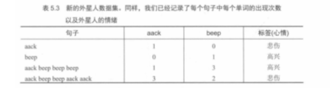
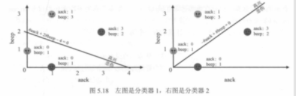
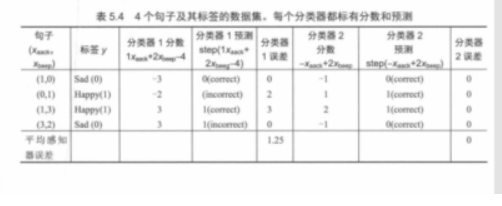
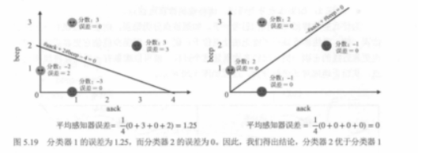

# 03. 误差函数（如何衡量分类器好坏）

在前面的小节里，我们已经能写出一个分类器（用 `score = w·x + b` 算分，再用 step 变成 0/1）。接下来最关键的问题是：

> 我怎么知道“这个分类器好不好”？  
> 如果不好，我该朝哪个方向改进？

答案就是：我们需要一个**误差函数**（也常被叫作 loss / error / 代价函数）。它的作用是把“分类得好不好”变成一个**可比较的数字**，这样我们才知道哪个分类器更好，也才有办法系统地优化它。

---

## 5.2.1 直觉：两个分类器都能分开，但哪个更好？

有时两个分类器都能把点分成两类，但直觉上我们会觉得其中一个更“靠谱”。图 5.12–5.14 就是在用三步把这个直觉推到“必须定义误差函数”的结论上。

### 图 5.12：先有“好坏”的人眼直觉，但没法让机器自动选

图 5.12 左边像“坏分类器”，右边像“好分类器”。它们的差别不在于有没有一条分界线，而在于分界线是不是把两类点的主要聚集区域分开了。

- **坏分类器（左）**：分界线切进了两类点的混合区，两侧都夹着不少“对方类别”的点。
- **好分类器（右）**：分界线更像是沿着两类点的“分界地带”划过去，把两类的主体区域分得更开。

你可以把它理解成“安全缓冲”的差别：

- 有的线离大多数点更远，留出了缓冲 → 数据有点噪声也不太容易翻车
- 有的线贴着点走，缓冲很小 → 稍微抖一下就可能把一批点推到另一侧

问题是：**这份直觉没法直接写成程序规则**。我们需要把“好不好”变成一个数字，让机器也能比较。

### 图 5.13：先试一个最简单的数字——错分数（分错了几个点）

最直接的想法是：误差 = 分错了多少个点。图 5.13 就把错分点圈出来，并给了具体数字：

- 左边错分更多（误差更大）
- 右边错分更少（误差更小）

在这种情况下，用“错分数”就能把两条线的优劣区分出来。

### 图 5.14：错分数会“失灵”——错得一样多，但直觉上仍有好坏

图 5.14 里两个分类器错分点的数量相同（都错分 1 个点），但我们仍然会觉得右边更差，因为：

- **左边**：错分点离分界线很近，属于“边界附近的擦边错”。你微调一下分界线，它很可能就能被分对。
- **右边**：错分点离分界线很远，属于“错得很离谱”。要想把它救回来，分界线得大幅移动，而这通常会牵连更多点。

这就引出一个结论：**我们不能只满足于“有没有分错/错了几个”**，还想知道“错得严不严重”“离边界远不远”。

---

## 误差函数 1：错分数（misclassification count）

最简单的误差函数是：

- 误差 = 分错了多少个点

它的优点：

- **最直观**：分错越少越好
- **最符合目标**：我们就是想少错

但它的问题也很明显：

- **它只告诉你“错没错”，不告诉你“错得有多离谱”**
- 很多不同的分界线，错分数可能完全一样，但直觉上它们优劣不同
- 更重要的是：当你想“微调”分界线时，错分数经常**不变**（改一点点，错分个数还是那些），这会让“怎么改进”变得没方向

所以：错分数可以当作一个指标，但往往不够用。

---

## 误差函数 2：距离（distance to boundary）

下一步就会想到：把“错得多远”也算进去。

一个很自然的做法是：

- **正确分类**的点，误差 = 0
- **错误分类**的点，误差 = “它到分界线的距离”

直觉：

- 错得离边界很近：误差小（也许一点点调整就能分对）
- 错得离边界很远：误差大（说明当前分界线对它真的很不合适）

书里用图 5.15–5.17 来解释这种“距离型误差”的想法：

### 图 5.15：为什么误差函数最好“平滑”，不要像台阶一样

这张图用“下山”类比：我们要沿着误差函数往下走，每一步都要能判断“往哪边走能稍微降低误差”。

- **左边（平滑曲线）**：几乎每个位置都有明确坡度，你能知道下一步该往哪走。
- **右边（台阶/平台）**：很多位置是平的，走一小步高度不变，你就很难判断该往哪走（优化容易卡住）。

所以后面我们会更偏好那种“连续、可逐步下降”的误差定义；而像“错分数”这种离散指标，往往不够好用。

### 图 5.16：错分点离分界线越远，错得越“重”

这张图把“错得严不严重”具体化成：错分点到分界线的**垂直距离**。

- **小距离 → 小误差**：点只是刚好站错边，分界线挪一点点就可能救回来。
- **大距离 → 大误差**：点已经跑到“很离谱”的区域里，说明当前分类器在这个点上非常自信地错了。

### 图 5.17：把每个错分点的距离加起来，就能比较两个分类器

这张图把“距离型误差”从单个点推广到整个数据集：把所有错分点的距离（图中用竖直虚线表示）加起来，得到一个总误差。

- **左边坏分类器**：错分点离边界更远，总误差更长。
- **右边好分类器**：错分点离边界更近，总误差更短。

因此即使错分个数相同，我们也能用“总距离”把两条线分出高下。

但“距离误差”还有两个现实问题：

- **算距离更麻烦**：你得显式计算点到直线/平面的几何距离
- **仍然需要一个更统一的写法**：方便推广到更高维特征空间

---

### 几何 → 代数：为什么 `score` 能代表“离分界线有多远”（二维焊死版）

先把“分界线”用我们已经在用的写法钉死：

- 分界线：`w·x + b = 0`
- 任意样本点的分数：`score = w·x + b`

在二维里，如果你把 `w` 写成 `(w1, w2)`，把 `x` 写成 `(x1, x2)`，那么：

- `score = w1*x1 + w2*x2 + b`

#### 1) 点到直线的垂直距离（高中几何）

平面上一个点到直线 `w1*x1 + w2*x2 + b = 0` 的**垂直距离**可以写成：

- `d = |w1*x1 + w2*x2 + b| / sqrt(w1*w1 + w2*w2)`

对照一下你就会发现：

- 分子 `|w1*x1 + w2*x2 + b|` 就是 `|score|`
- 分母 `sqrt(w1*w1 + w2*w2)` 是权重向量的长度，记作 `||w||`

也就是说：**垂直距离 = |score| 再除以 `||w||`**。

这里要小心一个细节：`w` 和 `b` 在训练里是会更新的，所以 `||w||` **不一定保持不变**。更准确的理解是：

- **对同一套参数（同一个 `w,b`）**：所有样本共享同一个 `||w||`，所以比较不同样本“谁离边界更远”时，`|score|` 和垂直距离只差同一个比例系数。
- **如果你把 `w` 和 `b` 同时按同一个正数成倍放大/缩小**：分界线 `w·x + b = 0` 往往不变，但 `score` 会同比变大/变小（这也是很多教材会额外谈“尺度/归一化”的原因）。

#### 2) 为什么图里常常只写 `score`，不每次都写“距离公式”？

因为分母 `||w||` 是一个**公共缩放系数**：

- 它不会改变“哪个点更远、哪个点更近”的**相对大小关系**
- 在很多优化讨论里，我们关心的是“谁更糟、该先救谁”，这类排序往往**乘一个固定正数不变**

所以工程上经常做一个简化：先把分母省略，直接用 `|score|` 当作“离分界线有多远”的替身。  
直觉版结论可以记成一句：

> **|score| 和垂直距离成正比；差别只是一个固定分母。**

#### 3) 从“距离”走到“误差大小”：正确为 0，错误才罚

- **正确分类**：点在正确一侧。无论离分界线多远，这类误差定义里通常都记 **error = 0**（不惩罚“离得多远”，只关心“站对边没”）。
- **错误分类**：点在错误一侧。离分界线越远，几何上垂直距离越大；代数上对应 `|score|` 也越大，于是“罚得更重”。

#### 4) 标签用 +1 / -1 时，一个特别好记的代数形式

有些推导会把两类标签写成 `y = +1` 和 `y = -1`（注意：这和本书表格里常用的 0/1 标签只是**记号不同**，思想一样）。

在这个记号下，**分错**时 `y` 和 `score` 的符号会“对着干”，于是 `y*score` 会是负数。把它翻成正的惩罚量，就得到一个很常见的写法：

- **若分错**：`error = -(y*score)`，它等于 `|score|`（因为分错时 `y*score` 为负，加负号变正）

你把它和上面的距离公式放在一起看，就会非常顺：

- 几何：垂直距离 ∝ `|score|`
- 代数：分错时 `-(y*score)` = `|score|`（在 `y ∈ {+1,-1}` 的约定下）

#### 5) 一个数字例子（把“成正比”算到你能看见）

假设分界线是 `x1 + x2 - 2 = 0`，也就是 `w1=1, w2=1, b=-2`，那么：

- `score = x1 + x2 - 2`
- `||w|| = sqrt(1*1 + 1*1) = sqrt(2)`
- 垂直距离 `d = |score| / sqrt(2)`

下面用 `y=+1` 表示正类（和上面的 `y ∈ {+1,-1}` 例子一致）：

| 样本点 (x1,x2) | 真实标签 y | score = x1+x2-2 | 是否分对 | 垂直距离 d = \|score\| / sqrt(2) | 误差（分错用 `-(y*score)`，分对为 0） |
|---|---:|---:|:---:|---:|---:|
| (3,3) | +1 | 4 | ✅ | 4 / sqrt(2) ≈ 2.83 | 0 |
| (0,0) | +1 | -2 | ❌ | 2 / sqrt(2) ≈ 1.41 | `-(+1)*(-2) = 2` |
| (-1,-1) | +1 | -4 | ❌ | 4 / sqrt(2) ≈ 2.83 | `-(+1)*(-4) = 4` |

一眼读表：

- (-1,-1) 比 (0,0) **离分界线更远**（垂直距离更大）
- 同时它的 `|score|` 更大，于是 `-(y*score)` 也更大

这就是你想焊死的那条链：**几何上的“远/近” ↔ 代数上的 `|score|` 大小 ↔（在分错时）误差惩罚大小**。

#### 6) 和线性回归差在哪（用一句话对齐直觉）

- **线性回归**：常常惩罚“预测值离真实值有多远”（沿输出方向的误差）。
- **感知机（这类边界模型）**：更关心“点站在分界线的哪一侧”；一旦站对边，很多定义里直接把误差记 0；站错边时，**离边界越远通常罚得越重**。

---

这就引出第三种做法：直接用 `score` 本身来定义误差。

---

## 误差函数 3：分数（score-based error / perceptron error）

记住一句话就够了：

> `score` 的符号决定对不对，`score` 的大小反映“离分界有多远”。

这句话不是“口号”，它背后就是上面那一小节焊死的对应关系：**在二维里，垂直距离与 `|score|` 只差一个固定分母**；所以很多图会直接拿 `score` 来定义误差。

因此可以用“分数”来定义误差，让它同时具备：

- 正确分类 → 误差为 0
- 错误分类 → 不但有误差，而且错得越“离谱”误差越大

一种常见写法（口语版）是：

- **若样本被正确分类**：error = 0
- **若样本被错误分类**：error = “把它推到正确一侧所需要的分数修正量”

你不必死记公式，把它当作“错得越离谱罚得越重”的打分规则即可。书里后面把这种误差函数叫作感知器误差（perceptron error）。

---

## 从“单个样本误差”到“整体误差”：平均感知器误差

数据集里有很多句子/点，我们需要把每个点的误差汇总成一个数字来比较两个分类器：

- 平均误差 = 把所有样本的误差加起来，再除以样本数

这有两个好处：

- **可比较**：不同分类器算出来就是一个数，谁小谁好
- **可优化**：有了“更连续”的误差定义后，后面才能用系统方法（比如迭代更新或梯度下降的思想）去让误差变小

书里给了一个完整的小例子：在同一个数据集上比较两个分类器（含图 5.18、表 5.3、表 5.4、图 5.19），最后通过“平均误差”判断哪个分类器更好：

### 表 5.3：先把句子变成特征（词频）

这里仍然用外星人语言里的两个词当特征：

- x_aack = `aack` 出现次数
- x_beep = `beep` 出现次数

### 图 5.18：两条不同的分界线（分类器 1 vs 分类器 2）

图里把同一个数据集画到二维平面上，并给出两条不同的直线：

- **分类器 1**：`1*aack + 2*beep - 4 = 0`
- **分类器 2**：`-1*aack + 1*beep = 0`（也就是 `beep = aack`）

### 表 5.4：把“分数 → step 预测 → 误差”算清楚

约定标签用 0/1 表示（Sad=0，Happy=1），预测用 `step(score)`：

- score < 0 → 预测 0（Sad）
- score >= 0 → 预测 1（Happy）

对每个样本，把两个分类器的分数、预测、误差都列出来，最后算平均感知器误差。

### 图 5.19：把平均误差画回图上（一眼比较）

这张图把每个点的误差标注在散点旁边，并在图下给出平均误差：

- 分类器 1：平均误差 = 1.25
- 分类器 2：平均误差 = 0

因此在这个小数据集上，**分类器 2 更好**。

你可以把这个例子总结成一句话：

- **错分数**只看“错了几个”
- **分数/距离型误差**还看“错得有多严重、离边界有多远”
- 因此它更适合用来“指导训练”，让分类器一步步变好

