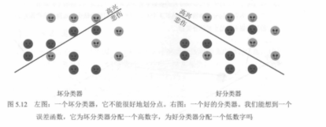
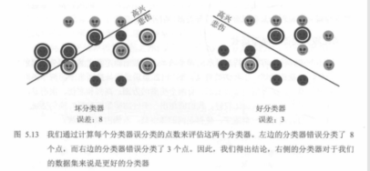
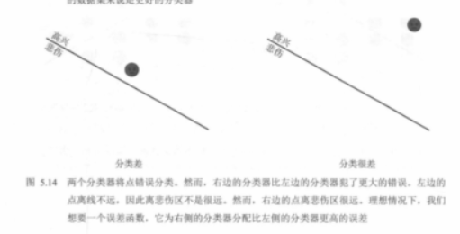
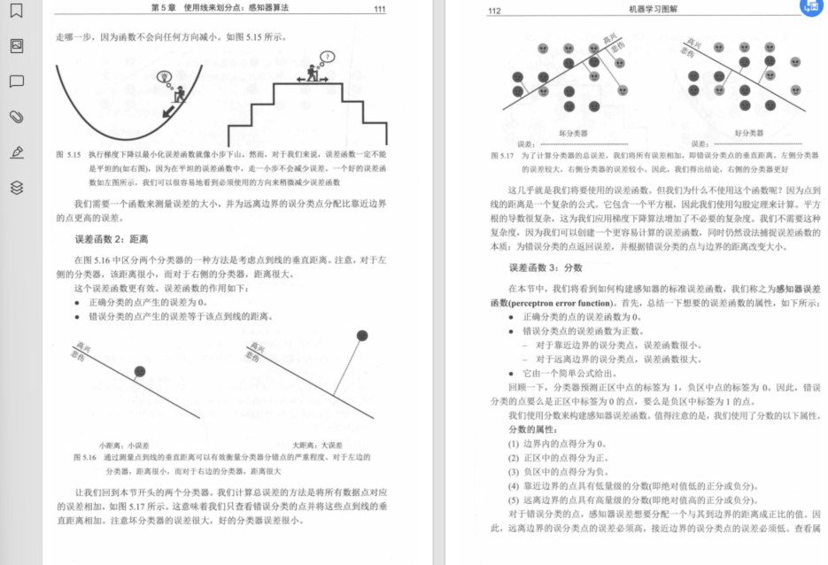
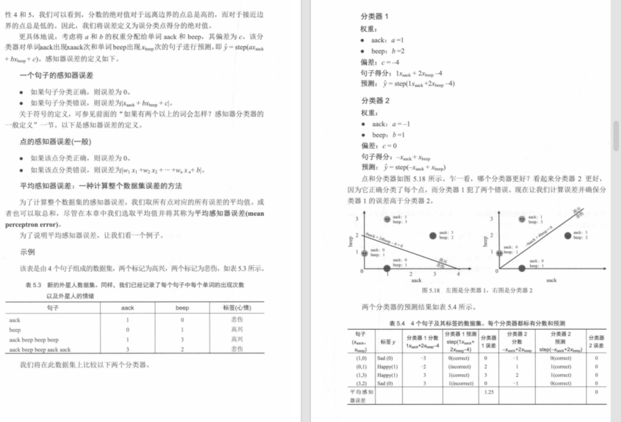
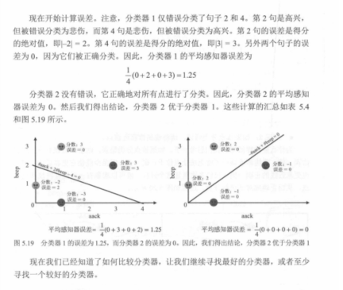

# 03. 误差函数（如何衡量分类器好坏）

在前面的小节里，我们已经能写出一个分类器（用 `score = w·x + b` 算分，再用 step 变成 0/1）。接下来最关键的问题是：

> 我怎么知道“这个分类器好不好”？  
> 如果不好，我该朝哪个方向改进？

答案就是：我们需要一个**误差函数**（也常被叫作 loss / error / 代价函数）。它的作用是把“分类得好不好”变成一个**可比较的数字**，这样我们才知道哪个分类器更好，也才有办法系统地优化它。

---

## 5.2.1 直觉：两个分类器都能分开，但哪个更好？

有时两个分类器都能把点分成两类，但直觉上我们会觉得其中一个更“靠谱”。图 5.12–5.14 就是在用三步把这个直觉推到“必须定义误差函数”的结论上。

### 图 5.12：先有“好坏”的人眼直觉，但没法让机器自动选

图 5.12 左边像“坏分类器”，右边像“好分类器”。它们的差别不在于有没有一条分界线，而在于分界线是不是把两类点的主要聚集区域分开了。

- **坏分类器（左）**：分界线切进了两类点的混合区，两侧都夹着不少“对方类别”的点。
- **好分类器（右）**：分界线更像是沿着两类点的“分界地带”划过去，把两类的主体区域分得更开。

你可以把它理解成“安全缓冲”的差别：

- 有的线离大多数点更远，留出了缓冲 → 数据有点噪声也不太容易翻车
- 有的线贴着点走，缓冲很小 → 稍微抖一下就可能把一批点推到另一侧

问题是：**这份直觉没法直接写成程序规则**。我们需要把“好不好”变成一个数字，让机器也能比较。

### 图 5.13：先试一个最简单的数字——错分数（分错了几个点）

最直接的想法是：误差 = 分错了多少个点。图 5.13 就把错分点圈出来，并给了具体数字：

- 左边错分更多（误差更大）
- 右边错分更少（误差更小）

在这种情况下，用“错分数”就能把两条线的优劣区分出来。

### 图 5.14：错分数会“失灵”——错得一样多，但直觉上仍有好坏

图 5.14 里两个分类器错分点的数量相同（都错分 1 个点），但我们仍然会觉得右边更差，因为：

- **左边**：错分点离分界线很近，属于“边界附近的擦边错”。你微调一下分界线，它很可能就能被分对。
- **右边**：错分点离分界线很远，属于“错得很离谱”。要想把它救回来，分界线得大幅移动，而这通常会牵连更多点。

这就引出一个结论：**我们不能只满足于“有没有分错/错了几个”**，还想知道“错得严不严重”“离边界远不远”。

---

## 误差函数 1：错分数（misclassification count）

最简单的误差函数是：

- 误差 = 分错了多少个点

它的优点：

- **最直观**：分错越少越好
- **最符合目标**：我们就是想少错

但它的问题也很明显：

- **它只告诉你“错没错”，不告诉你“错得有多离谱”**
- 很多不同的分界线，错分数可能完全一样，但直觉上它们优劣不同
- 更重要的是：当你想“微调”分界线时，错分数经常**不变**（改一点点，错分个数还是那些），这会让“怎么改进”变得没方向

所以：错分数可以当作一个指标，但往往不够用。

---

## 误差函数 2：距离（distance to boundary）

下一步就会想到：把“错得多远”也算进去。

一个很自然的做法是：

- **正确分类**的点，误差 = 0
- **错误分类**的点，误差 = “它到分界线的距离”

直觉：

- 错得离边界很近：误差小（也许一点点调整就能分对）
- 错得离边界很远：误差大（说明当前分界线对它真的很不合适）

书里用图 5.15–5.17 来解释这种“距离型误差”的想法：

但“距离误差”还有两个现实问题：

- **算距离更麻烦**：你得显式计算点到直线/平面的几何距离
- **仍然需要一个更统一的写法**：方便推广到更高维特征空间

这就引出第三种做法：直接用 `score` 本身来定义误差。

---

## 误差函数 3：分数（score-based error / perceptron error）

记住一句话就够了：

> `score` 的符号决定对不对，`score` 的大小反映“离分界有多远”。

因此可以用“分数”来定义误差，让它同时具备：

- 正确分类 → 误差为 0
- 错误分类 → 不但有误差，而且错得越“离谱”误差越大

一种常见写法（口语版）是：

- **若样本被正确分类**：error = 0
- **若样本被错误分类**：error = “把它推到正确一侧所需要的分数修正量”

你不必死记公式，把它当作“错得越离谱罚得越重”的打分规则即可。书里后面把这种误差函数叫作感知器误差（perceptron error）。

---

## 从“单个样本误差”到“整体误差”：平均感知器误差

数据集里有很多句子/点，我们需要把每个点的误差汇总成一个数字来比较两个分类器：

- 平均误差 = 把所有样本的误差加起来，再除以样本数

这有两个好处：

- **可比较**：不同分类器算出来就是一个数，谁小谁好
- **可优化**：有了“更连续”的误差定义后，后面才能用系统方法（比如迭代更新或梯度下降的思想）去让误差变小

书里给了一个完整的小例子：在同一个数据集上比较两个分类器（含图 5.18、表 5.3、表 5.4、图 5.19），最后通过“平均误差”判断哪个分类器更好：

你可以把这个例子总结成一句话：

- **错分数**只看“错了几个”
- **分数/距离型误差**还看“错得有多严重、离边界有多远”
- 因此它更适合用来“指导训练”，让分类器一步步变好

