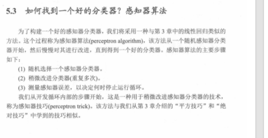
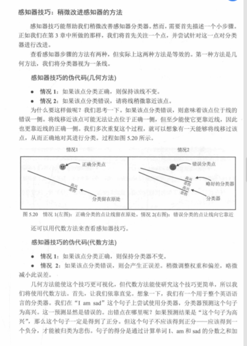
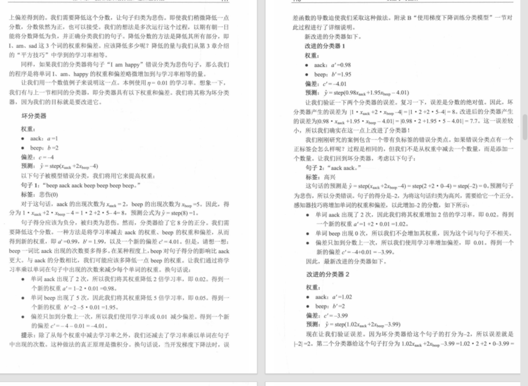
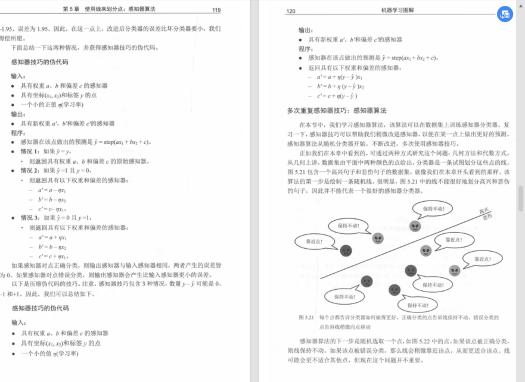
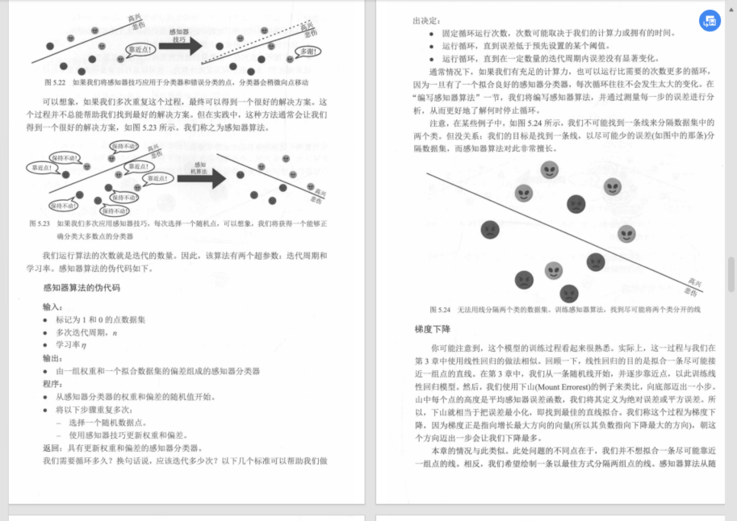

# 04. 感知器算法（Perceptron algorithm / perceptron trick）

这一节回答的问题很直接：

> 我已经会用 `score = w·x + b` + `step` 做分类了。  
> 那么 **w 和 b 到底怎么“训练”出来**，才能得到一个更好的分类器？

---

## 5.3 的总体路线（书里的三步）

可以把这一节当成“找一个好分类器”的流程：

- **先随机选一个分类器**（先随便给一组 w、b）
- **用误差函数评价它**（上一节 5.2 刚讲完）
- **不断微调它**：让误差越来越小

这套流程就是本章的“感知器算法”（perceptron algorithm）。

---

## 感知器技巧（perceptron trick）：最直觉的微调方法

核心直觉只有一句话：

> **错分的点，说明分界线“站错边”了**；  
> 我们就把分界线往“能把它分对”的方向推一点点。

书里先用几何图讲这个动作（图 5.20）：

### 图 5.20 的两种情况在说什么

- **情况 1：点分对了**  
  分界线不动（因为它对这个点已经没问题）

- **情况 2：点分错了**  
  让分界线往能把它分对的方向“挪一点点”

这里的“挪一点点”，后面会用一个数来控制，它就是 **学习率**（步子大小）。

---

## 用一句更“能算”的话描述：更新 w 和 b

你可以这样理解分类器：

- `w` 决定分界线的**方向**（斜率/朝向）
- `b` 决定分界线的**位置**（整体平移）

所以“挪动分界线”，等价于“微调 w 和 b”。

截图后面给了一个带具体数字的更新例子（同样属于图 5.20 的延伸讲解）：

你不需要被细节吓到，它想表达的是：

- 错分样本会对参数产生一次“推力”
- 推力大小由学习率控制
- 更新一次后，再重新算分数，看它是否更接近被分对

---

## 把“不断微调”变成算法：循环 + 停止条件

因为一次更新只改一点点，所以要重复很多次。

这一节后面几张图在讲“为什么要循环”和“循环里发生了什么”：

### 图 5.21：每个点都来“评价”一下分类器

图里对话框的意思是：

- 点被分对：告诉你“保持不动”
- 点被分错：告诉你“往我这边挪一点点”

### 图 5.22–5.23：重复多次后，分界线会逐步变好

这两张图的主旨是：**你会看到分界线一点点移动**，错分变少，或者错得不那么离谱。

### 图 5.24：当数据本身不可完全线性可分时

书里也提醒：有些数据怎么挪都不可能做到“零错误”。这时算法的目标就变成：

- 尽量让误差变小
- 或者在有限的迭代次数里找到一个“够好”的分界

这些内容在图 5.22–5.24 里用连续的示意图解释：

---

## 伪代码（你只要抓住循环结构）

把这一节的算法浓缩成伪代码，你可以按下面记：

- 初始化 w、b（随机或全 0）
- 重复多轮（epoch）
  - 遍历每个样本 (x, y)
  - 计算预测 `y_hat = step(w·x + b)`
  - 如果预测错了：更新 w、b（让它更倾向分对这个点）

不同教材的更新公式写法会有差异（标签用 0/1 还是 ±1），但“错了就推一下”的结构是不变的。

---

## 和梯度下降的关系（你截图最后那一段）

你截图里最后一段标题在引出：

- **随机梯度下降（SGD）**：一次用一个样本来更新（上面这种逐点更新就很像）
- **批量梯度下降（Batch GD）**：一次用全体样本的平均误差来更新

你可以先用一句话建立直觉：

- 感知器技巧强调“看到一个错分点就立刻推一下”
- 梯度下降强调“用误差函数告诉你整体该往哪走，再走一步”

后面如果你继续截 5.3 里关于 SGD / Batch GD 的更多页，我可以把这一块也补成更完整的小节（并保持和你前面笔记同样的“直白、不堆术语”风格）。

