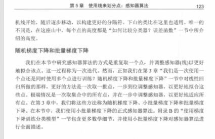

# 04. 感知器算法（Perceptron algorithm / perceptron trick）

这一节回答的问题很直接：

> 我已经会用 `score = w·x + b` + `step` 做分类了。  
> 那么 **w 和 b 到底怎么“训练”出来**，才能得到一个更好的分类器？

---

## 5.3 的总体路线（书里的三步）

可以把这一节当成“找一个好分类器”的流程：

- **先随机选一个分类器**（先随便给一组 w、b）
- **用误差函数评价它**（上一节 5.2 刚讲完）
- **不断微调它**：让误差越来越小

这套流程就是本章的“感知器算法”（perceptron algorithm）。

---

## 感知器技巧（perceptron trick）：最直觉的微调方法

核心直觉只有一句话：

> **错分的点，说明分界线“站错边”了**；  
> 我们就把分界线往“能把它分对”的方向推一点点。

书里先用几何图讲这个动作（图 5.20）：

### 图 5.20 的两种情况在说什么

- **情况 1：点分对了**  
  分界线不动（因为它对这个点已经没问题）

- **情况 2：点分错了**  
  让分界线往能把它分对的方向“挪一点点”

这里的“挪一点点”，后面会用一个数来控制，它就是 **学习率**（步子大小）。

### 学习率到底是什么？为什么要它？

你可以把训练想象成“调旋钮”：每次看到一个错分样本，我们就把 `w` 和 `b` 往更可能分对的方向拧一下。

- **学习率**（常用符号是 eta；在代码里也经常直接叫 `lr`）就是告诉你：
  - 这次旋钮**拧多大**
  - 也就是每次更新时，参数变化量要乘的那个比例

为什么必须“拧小一点”，而不是一步到位？

- **一步到位通常做不到**：你不知道“刚好分对”的那组参数在哪里；就算知道，也很难一次算出来。
- **小步更新更稳**：每次只根据当前这个样本（或一小批样本）给出一个“改进方向”，走一小步，不容易把模型一下子推到更糟的地方。
- **需要重复很多次**：小步意味着单次改变有限，所以要像后面图 5.21–5.23 那样反复迭代。

### 学习率太大 / 太小会怎样（直觉版）

- **太大**：每一步改动过猛，分界线可能“来回乱跳”，甚至越训越差（像下山步子太大直接跨过谷底）。
- **太小**：训练非常慢，可能要很多轮才看到明显改善（像蜗牛下山）。

实际使用里，学习率往往是一个需要你**试**的超参数：先从比较小的值开始，观察误差是否稳定下降，再决定要不要调大/调小。

### 它和“随机梯度下降（SGD）”有什么关系？

当你用“每次抽一个样本 → 算误差/错分信号 → 更新参数”的方式训练时，本质上就很接近 **SGD**：

- **SGD**：一次用一个样本（或一个很小的 batch）来更新
- **Batch GD**：一次用全体样本把梯度/更新方向算平均，再更新一次（每步更“全局”，但每步也更贵）

感知器技巧那种“看到一个点就推一下”的更新节奏，读起来更像 SGD 的直觉版本；后面如果你把误差函数写得更严格，就会更明显地看到“梯度 × 学习率”的形式。

---

## 用一句更“能算”的话描述：更新 w 和 b

你可以这样理解分类器：

- `w` 决定分界线的**方向**（斜率/朝向）
- `b` 决定分界线的**位置**（整体平移）

所以“挪动分界线”，等价于“微调 w 和 b”。

截图后面给了一个带具体数字的更新例子（同样属于图 5.20 的延伸讲解）：

### 这张图在算什么？（把“推一下分界线”翻译成可操作的数字）

它用一个很具体的线性分类器当起点（书里叫它“坏分类器”）：

- 特征：`x_aack`、`x_beep`（两个词的出现次数）
- 参数：权重 `w_aack = 1`、`w_beep = 2`，偏差 `b = -4`
- 预测：先算分数 `score = w_aack * x_aack + w_beep * x_beep + b`，再用 `step(score)` 变成 0/1

同时给了一个很小的 **学习率** `lr = 0.01`，用来控制“每次更新拧多小”。

### 例子 1：真实标签是 Sad，但模型预测成 Happy（分数太高）

句子：`beep aack aack beep beep beep beep`

- `x_aack = 2`，`x_beep = 5`
- `score = 1*2 + 2*5 + (-4) = 8`
- `step(8) = 1`（Happy）→ 但标签是 Sad（0），所以错了

目标是：**把分数往下拉**（让它别那么“像 Happy”）。

书里用的更新（你可以把它理解成“沿着特征按比例往回拽”）是：

- `w_aack' = w_aack - lr * x_aack = 1 - 0.01*2 = 0.98`
- `w_beep' = w_beep - lr * x_beep = 2 - 0.01*5 = 1.95`
- `b' = b - lr = -4 - 0.01 = -4.01`

于是新分类器变成：

- `score' = 0.98*x_aack + 1.95*x_beep - 4.01`

直觉：这条错分样本里 **`beep` 出现得更多**，所以 `w_beep` 被扣得更多；`aack` 少一些，就扣得少一些。

### 例子 2：真实标签是 Happy，但模型预测成 Sad（分数太低）

句子：`aack aack`

- `x_aack = 2`，`x_beep = 0`
- `score = 1*2 + 2*0 + (-4) = -2`
- `step(-2) = 0`（Sad）→ 但标签是 Happy（1），所以错了

目标是：**把分数往上拉**。

更新方向与例子 1 相反：

- `w_aack' = w_aack + lr * x_aack = 1 + 0.01*2 = 1.02`
- `w_beep' = w_beep + lr * x_beep = 2 + 0.01*0 = 2`（因为这句里没有 `beep`，这一项自然不变）
- `b' = b + lr = -4 + 0.01 = -3.99`

于是新分类器变成：

- `score' = 1.02*x_aack + 2*x_beep - 3.99`

### 你真正要记住的“模板”

- **预测错了，就更新一次参数**；更新幅度 = **学习率 ×（样本特征）**
- **假阳性**（该 Sad 却判 Happy，分数偏高）：权重/偏差整体做“减法方向”的修正
- **假阴性**（该 Happy 却判 Sad，分数偏低）：权重/偏差整体做“加法方向”的修正

你不需要被细节吓到，它想表达的是：

- 错分样本会对参数产生一次“推力”
- 推力大小由学习率控制
- 更新一次后，再重新算分数，看它是否更接近被分对

---

## 把“不断微调”变成算法：循环 + 停止条件

因为一次更新只改一点点，所以要重复很多次。

这一节后面几张图在讲“为什么要循环”和“循环里发生了什么”：

### 图 5.21：每个点都来“评价”一下分类器

图里对话框的意思是：

- 点被分对：告诉你“保持不动”
- 点被分错：告诉你“往我这边挪一点点”

### 图 5.22：对“一个错分点”应用感知器技巧

这张图把感知器技巧画成“前后对比”：

- **错分点**会对分界线说“靠近点！”
- 分界线就会**朝着这个点挪一点点**（不一定立刻分对，但方向是在纠错）

### 图 5.23：多次随机应用感知器技巧，线会逐步变好

这张图强调“迭代”：如果你反复做下面这件事——

- 每次随机挑一个点
- 若错分，就用感知器技巧推一下分界线

那么分界线会一步步移动，最终往往能得到一个**能分对大多数点**的分类器。

### 图 5.24：当数据本身不可完全线性可分时

书里也提醒：有些数据怎么挪都不可能做到“零错误”。这时算法的目标就变成：

- 尽量让误差变小
- 或者在有限的迭代次数里找到一个“够好”的分界

这张图就是“线性不可分”的典型情况：你怎么画一条直线，都很难做到两边完全纯净；训练感知器算法时，目标会变成**尽量**把两类分开（减少错误/降低误差），而不是追求“零错误”。

---

## 伪代码（你只要抓住循环结构）

把这一节的算法浓缩成伪代码，你可以按下面记：

- 初始化 w、b（随机或全 0）
- 重复多轮（epoch）
  - 遍历每个样本 (x, y)
  - 计算预测 `y_hat = step(w·x + b)`
  - 如果预测错了：更新 w、b（让它更倾向分对这个点）

不同教材的更新公式写法会有差异（标签用 0/1 还是 ±1），但“错了就推一下”的结构是不变的。

---

## 和梯度下降的关系（你截图最后那一段）

你截图里最后一段标题在引出：

- **随机梯度下降（SGD）**：一次用一个样本来更新（上面这种逐点更新就很像）
- **批量梯度下降（Batch GD）**：一次用全体样本的平均误差来更新

你可以先用一句话建立直觉：

- 感知器技巧强调“看到一个错分点就立刻推一下”
- 梯度下降强调“用误差函数告诉你整体该往哪走，再走一步”

后面如果你继续截 5.3 里关于 SGD / Batch GD 的更多页，我可以把这一块也补成更完整的小节（并保持和你前面笔记同样的“直白、不堆术语”风格）。

