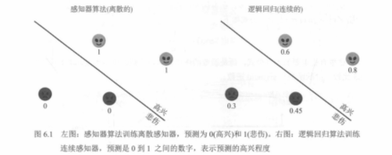
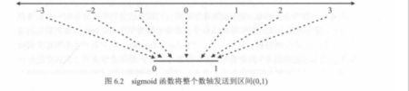
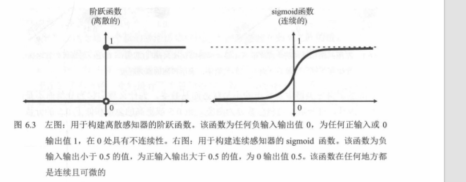
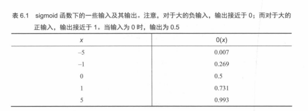
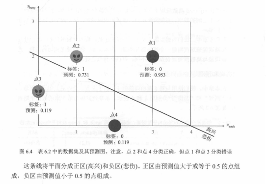
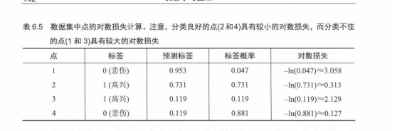

# 01. 逻辑分类器简介

这一章回答一个很现实的问题：分类不只是“对/错”，我们还常常想知道**把握有多大**。

下面这份笔记按教材推进顺序，把 **6.1（连续版感知器/逻辑分类器）→ sigmoid → 例子（表 6.2 / 图 6.4）→ 误差函数（表 6.3 / 表 6.4）→ 对数损失（表 6.5）→ 两个分类器对比（表 6.6 / 图 6.5）→ 6.2（逻辑回归算法）** 串成一条能一口气读完的链路。

同一目录下保留了教材对应的关键插图（`imagine6.*.png`、`imagine-table6.*.png`），下面正文会在讲到对应图/表处直接引用。

> 小提示：第 5 章已经把 `score = w·x + b`、分界线、以及“`score` 大小和离边界远近”的几何直觉讲得很细了；本章重点放在：**如何把 score 变成 0～1 的概率式输出**，以及**为什么训练要用对数损失**。

---

## 6.1 逻辑分类器：连续版感知器分类器（图 6.1）

第 5 章的感知器输出很“硬”：最后通常用阶跃函数把分数变成 **0 或 1**。

逻辑分类器（书里也叫**连续版感知器** / 连续感知器）仍然用一条直线（更高维则是超平面）去划分空间，但输出不再是只有两档，而是一个落在 **(0, 1)** 区间里的数，常把它理解成：

- **越接近 1**：越像正类（本书例子里常对应“高兴”，标签记为 **1**）
- **越接近 0**：越不像正类（常对应“悲伤”，标签记为 **0**）
- **接近 0.5**：最不确定（分界线附近）

### 图 6.1：离散 vs 连续（同一条分界线，不同输出）

图 6.1 左右两幅图用的是**同一条分界线**、同一批点，差别只在输出形式：

- **左：感知器（离散）**  
  点在分界线一侧就标 **1**，另一侧就标 **0**。离分界线远不远，输出都还是 0 或 1——**没有“把握程度”**。

- **右：逻辑分类器（连续）**  
  同样的点会标成 **0.3、0.45、0.6、0.8** 这种小数：离分界线越近越接近 **0.5**，越远越接近 **0 或 1**。

读图时你只要抓一个规律：**点离分界线越近，输出越接近 0.5（更不确定）；离分界线越远，输出越接近 0 或 1（更确定）**。

> 备注：有些教材配图下方的文字说明，可能把“0/1 各自对应哪一类”写得很简略；读图时以坐标分区上的文字（高兴/悲伤）和点的标注为准，最重要的是**全书符号自洽**。

### 它还是“分类器”：阈值把概率变回类别

虽然输出是小数，但它仍然是分类器：我们常用阈值 **0.5** 做硬分类：

- 预测 ≥ 0.5 → 判为正类（更偏高兴）
- 预测 < 0.5 → 判为负类（更偏悲伤）

---

## 分类的概率方法：sigmoid（图 6.2、图 6.3、表 6.1）

### 图 6.2：把整条数轴“压进”(0, 1)

你可以把 `score`（也就是线性部分 `w·x + b`）想成**任意实数**：可正可负、可大可小。

sigmoid（书里常记作 `σ`）做的事很直观：**把 (-∞, +∞) 映射到 (0, 1)**，所以输出天然适合当“概率/倾向”。

看图里几个“锚点”会特别好记：

- `score = 0` → 输出落在中间（0.5）：**最不确定**
- `score` 越正 → 输出越靠近 1：**越像正类**
- `score` 越负 → 输出越靠近 0：**越不像正类**

### 图 6.3：阶跃函数 vs sigmoid（为什么训练里更常用 sigmoid）

图 6.3 把两种激活函数摆在一起，差别一眼就能看出来：

- **左：阶跃函数（step，离散）**  
  输出几乎只有两档（0/1），在阈值附近会“跳变”。它是**硬判决**。

- **右：sigmoid（连续）**  
  输出在 0～1 之间连续变化，曲线光滑。它是**软输出**。

为什么要换成 sigmoid（新手最该记住的两条）：

- **能输出“把握有多大”**：不仅告诉你更偏哪一类，还告诉你离 0.5 有多远。
- **更利于用“平滑损失 + 基于斜率的更新”去训练**：step 在大多数地方“太平”，阈值点又太“尖”，很多优化细节会更别扭；sigmoid 这种连续曲线更好处理。

### 表 6.1：几个具体输入输出（把 sigmoid 变成“手感”）

表 6.1 给了几组输入输出，用来建立直觉：**大正数靠近 1，大负数靠近 0，0 在中间**。

你可以把表里的数当成“手感校准器”：

- 输入从 0 走到 1，输出会从 0.5 明显往上抬
- 输入继续变大，输出会**越来越接近 1**，但通常不会完全等于 1（同理负数侧接近 0）

书里也会写出 sigmoid 的解析式（你可以把它当成“实现细节”）：  
`σ(x) = 1 / (1 + exp(-x))`  
新手先不必纠缠推导，先把 **“压到 (0,1)”** 这件事记牢就够了。

---

## 一个完整小例子：表 6.2 → 图 6.4（预测、阈值、为什么会错）

### 表 6.2：把句子变成坐标（特征工程的最小示范）

表 6.2 是一个非常标准的“文本 → 特征向量”的例子：

- 特征 1：单词 `aack` 出现次数（记 `x_aack`）
- 特征 2：单词 `beep` 出现次数（记 `x_beep`）
- 标签：高兴记为 **1**，悲伤记为 **0**

把它翻译成“机器学习语言”就是：每个句子变成一个点 `(x_aack, x_beep)`，并带一个真实标签 `y ∈ {0,1}`。

### 逻辑分类器 1：从线性分数到概率预测

书里给了一个具体模型（权重/偏置都用常数表示）：

- `a = 1`（`aack` 的权重）
- `b = 2`（`beep` 的权重）
- `c = -4`（偏置）

预测写作：

- `ŷ = σ(1·x_aack + 2·x_beep - 4)`

对表 6.2 的四个点，先把括号里的线性部分算出来，再送进 sigmoid，就会得到图 6.4 里那组预测概率（书中算式大致如下）：

- 句子 1 `(3,2)`：`σ(3 + 2·2 - 4) = σ(3) = 0.953`
- 句子 2 `(1,2)`：`σ(1 + 2·2 - 4) = σ(1) = 0.731`
- 句子 3 `(0,1)`：`σ(0 + 2·1 - 4) = σ(-2) = 0.119`
- 句子 4 `(2,0)`：`σ(2 + 2·0 - 4) = σ(-2) = 0.119`

### 图 6.4：分界线把平面分成“正区/负区”，但概率仍可能和标签冲突

图 6.4 把四个点画在 `x_aack`–`x_beep` 平面上，并画出分界线：

- `x_aack + 2·x_beep - 4 = 0`

这条线把平面分成：

- **正区（更偏高兴）**：预测概率 **≥ 0.5**
- **负区（更偏悲伤）**：预测概率 **< 0.5**

因此你会看到两类“错误”并不一样：

- **错得很自信**：真实标签是 0，但预测概率很高（接近 1）——模型“非常确定但完全错了”。
- **错得不自信**：真实标签是 1，但预测概率很低（接近 0）——模型“更偏另一边”。

这也自然引出下一问题：训练时，我们该用什么样的误差函数，才能让模型**尤其害怕**第一种错误？

---

## 误差函数：从“看起来合理”到“更适合分类训练”（表 6.3、表 6.4）

### 一个好的误差函数想满足什么？

对分类器来说，我们希望误差大概满足：

- **分对了**：误差应该是**小数字**
- **分错了**：误差应该是**大数字**
- **整体误差**：把所有点的误差加起来（或取平均）

### 表 6.3：先把“该不该大/小”对齐直觉

对图 6.4 那四个点，书里用一张表把“预测离标签远不远”翻译成“误差应该大还是小”：

- 点 1：标签 0，但预测 0.953 → 误差应该**很大**
- 点 2：标签 1，预测 0.731 → 误差应该**很小**
- 点 3：标签 1，预测 0.119 → 误差应该**很大**
- 点 4：标签 0，预测 0.119 → 误差应该**很小**

### 误差函数 1/2：绝对误差与平方误差（表 6.4）

书里先借用回归里熟悉的两种误差：

- **绝对误差**：`|y - ŷ|`
- **平方误差**：`(y - ŷ)^2`

并用四个点算出具体数值（表 6.4）。

它们当然“能用”，但书里会指出一个关键痛点：在 **y 与 ŷ 都在 [0,1]** 的场景里，这两种误差的量级往往被限制得比较死，对“非常自信但完全错了”的情况，惩罚不一定够狠、也不够贴合“概率训练”的语言。

---

## 误差函数 3：对数损失 log loss（表 6.5）——为什么分类里更常用

### 先把预测当成概率：模型到底给“正确标签”打了多少分？

如果 `ŷ` 表示“模型认为样本属于正类（高兴，标签 1）的概率”，那么：

- “属于负类（悲伤，标签 0）”的概率就是 **`1 - ŷ`**

于是对每个点，我们都能定义一个最关键的数：

- **标签概率（模型对真实标签给出的概率）**  
  - 若 `y = 1`：标签概率 = `ŷ`
  - 若 `y = 0`：标签概率 = `1 - ŷ`

你会发现：模型越好，**标签概率越接近 1**；模型越差（尤其自信但错了），**标签概率会接近 0**。

### 为什么要 `ln`？因为“连乘很多小数”在计算机里会崩

如果假设各点独立，整体“全对上的概率”会把每个点的标签概率**连乘**起来。样本一多，乘积会变得极小，出现**数值下溢**（计算机表示不了那么小的数）。

所以书里用对数把乘法变加法（核心性质）：

- `ln(A·B) = ln(A) + ln(B)`

对数后的值通常是负数；为了把它变成“越大越糟”的损失，再取负号，得到 **log loss（对数损失）**。

### 表 6.5：四个点的逐点损失（你看的不是“公式”，是“脾气”）

表 6.5 把每个点的：

- 标签
- `ŷ`（正类概率）
- 标签概率
- `-ln(标签概率)`

都算出来，用来展示：**分得好 → 损失小；分得差（尤其自信但错）→ 损失非常大**。

### 一个点的统一写法（不用分段也能记）

令 `y ∈ {0,1}`，`ŷ` 为“正类概率”。一个点的 log loss 常写成：

- `loss = -( y·ln(ŷ) + (1-y)·ln(1-ŷ) )`

它只是一个“开关写法”：

- `y=1` 时，第二项消失，只剩 `-ln(ŷ)`
- `y=0` 时，第一项消失，只剩 `-ln(1-ŷ)`

书里也会提到：log loss 和 **交叉熵（cross entropy）** 关系很密切——你可以先把它理解成：**用概率语言衡量“预测分布离真实标签有多远”**。

---

## 用 log loss 比较两个逻辑分类器（表 6.6、图 6.5）

当误差函数确定后，我们就能像“比分数”一样比模型好坏。

### 两个模型（书中写法）

- **逻辑分类器 1**：`ŷ = σ(x_aack + 2·x_beep - 4)`
- **逻辑分类器 2**：`ŷ = σ(-x_aack + x_beep)`

### 表 6.6：四个点上的 `ŷ` 对比

表里会列出每个点在两个模型下的预测概率。直觉读法很简单：

- 对 `y=1` 的点：`ŷ` 越接近 1 越好
- 对 `y=0` 的点：`ŷ` 越接近 0 越好（也就是 `1-ŷ` 越接近 1 越好）

### 图 6.5：几何上看“哪条线更会把两类分开”

图 6.5 左右两幅图对应两条分界线（同一个数据集）：

- 左：分类器 1 的线更容易让点“站错边/站得离谱”
- 右：分类器 2 的线更能把两类点放到各自更合理的区域

### 用总 log loss 一锤定音（书中数值结论）

书里会给出一个非常“痛快”的对比结论（你记结论就行）：

- **分类器 1** 的总 log loss 约 **5.616**
- **分类器 2** 的总 log loss 约 **1.066**

因此在这个数据集上，**分类器 2 更好**。

---

## 6.2 怎么找到好的逻辑分类器？逻辑回归算法（训练循环）

这一节的主线跟线性回归/感知器很像：

1. 从一个**随机**逻辑分类器开始
2. 重复很多次：每次把分类器**稍微改好一点**
3. 用 **log loss** 判断有没有变好、以及什么时候可以停

你不需要在这一章就把所有更新细节背下来，先把循环结构记住：**模型 + 误差 + 迭代改进**。

---

## 阈值 0.5（本章默认）

得到 0～1 的预测概率后，如果仍要输出硬分类（开心/难过），通常设阈值 **0.5**：

- 预测概率 ≥ 0.5 → 判为正类
- 预测概率 < 0.5 → 判为负类

0.5 是常见、简便的默认选择；第 7 章会讨论如何调整阈值来优化实际指标（准确率/召回率等）。

---

## 与第 5 章的关系（本章到底改了哪几块）

本章建立在第 5 章之上：整体仍是“线性打分 + 激活 + 用误差指导更新”，但有三处关键变化：

1. **激活函数**：step → sigmoid（输出从离散 0/1 变成连续概率）
2. **误差函数**：围绕概率的误差（本章用 log loss）
3. **更新技巧**：从感知器技巧，过渡到更适合 log loss 的训练方式（逻辑回归）

---

## 数值计算提示

若按公式手算，你的结果可能与书中略有差异。书中多在**公式最后**再四舍五入，而不是每一步都舍入；按「每两步舍入」或「每步舍入」会得到稍不同的中间值，对**最终结论影响很小**，可忽略。

---

## 本章应用：IMDB 影评情感

学完本章后，将把逻辑分类器应用到真实数据：**IMDB**（https://www.imdb.com）上的**电影评论**。用逻辑分类器预测一条影评是**正面**还是**负面**，作为二分类的连续方法示例。

---

## 补充直觉：为什么要“0～1 的分数”？

在现实任务里，我们往往不仅想知道“正/负”，还想知道：

- 这次判断**有多确定**？
- 这是“勉强算正类”，还是“几乎肯定是正类”？

逻辑分类器输出的 0～1，就可以表达这种“确定程度/正类倾向”。例如：

- 0.60：更偏正类，但不是很确定
- 0.95：强烈偏正类，非常确定

---

## 本章相关笔记

- `02.Sigmoid与对数损失.md`：sigmoid 与 log loss 的“工具箱级”整理（定义、性质、二者如何配套）
- `03.逻辑回归算法.md`：6.2 训练循环与更新直觉（逻辑回归）

---

## 参考代码

书中本章相关代码仓库：

- `https://github.com/luisguiserrano/manning/tree/master/Chapter_6_Logistic_Regression`
