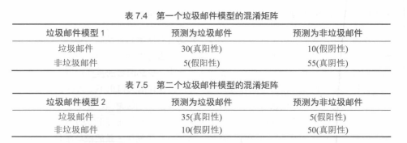

# 01.2 混淆矩阵、Precision-Recall 与 F（7.2）

## 混淆矩阵：把「预测结果」拆开看

以二分类为例（正类 positive / 负类 negative），我们可以把模型在测试集上的表现统计成一个 **2×2 表格**——**混淆矩阵（confusion matrix）**：

- **真正例（TP, true positive）**：真实为正类，预测也为正类。
- **假正例（FP, false positive）**：真实为负类，却被预测为正类。
- **真负例（TN, true negative）**：真实为负类，预测也为负类。
- **假负例（FN, false negative）**：真实为正类，却被预测为负类。

## 7.2 如何解决准确率问题？先分清“误报”和“漏检”

准确率会骗人，根子在于：它把所有错误都当成同一种错。解决办法是先把错误拆成两类方向：

- **假阳性（FP）**：把负类错当成正类（误报/误检）
- **假阴性（FN）**：把正类错当成负类（漏检/漏诊）

为了让你能把定义和业务直觉对齐，可以用两组贯穿例子来“落地”：

| 术语 | 通俗说法 | 定义（新人版） | 医疗筛查（新冠/疾病） | 垃圾邮件过滤 |
|---|---|---|---|---|
| **TP** | 找对了 | 真实是正类，预测也是正类 | 病人被判为患病 | 垃圾邮件被判为垃圾 |
| **TN** | 没搞错 | 真实是负类，预测也是负类 | 健康人被判为健康 | 正常邮件被判为正常 |
| **FP** | 误报 | 真实是负类，却预测成正类 | 健康人被误诊（多做检查） | 正常邮件被误删（很糟） |
| **FN** | 漏检 | 真实是正类，却预测成负类 | 病人被放走（很糟） | 垃圾邮件被漏掉 |

有了这四个数，就能写出一系列常见指标：

- **准确率**：`Acc = (TP + TN) / (TP + TN + FP + FN)`
- **错误率**：`Err = (FP + FN) / (TP + TN + FP + FN)`

## 召回率（Recall）与精确率（Precision）

- **召回率（recall / sensitivity / true positive rate, TPR）**  
  `Recall = TP / (TP + FN)`  
  含义：在所有真实为正的样本中，有多大比例被模型「找出来」。**越高表示漏检越少**。

- **精确率（precision / positive predictive value, PPV）**  
  `Precision = TP / (TP + FP)`  
  含义：在所有被模型预测为正的样本中，有多大比例是真的正类。**越高表示误报越少**。

二者构成了一种典型的**权衡**：

- 把模型阈值调得「更激进」、更容易预测为正类 → **召回率↑，精确率可能↓**（多抓病人，也多误报健康人）。
- 把阈值调得「更保守」、不轻易预测为正类 → **精确率↑，召回率可能↓**（报出的病人大多是真的，但漏掉了不少）。

在实际应用中，通常要先想清楚：**我们更怕哪一种错误？**

- 医疗筛查中往往更重视**召回率**（宁可多一些复查，也不要漏诊）。
- 垃圾邮件过滤中可能更重视**精确率**（不想把正常邮件错删）。

## F1 分数：在精确率与召回率之间折中

有时希望用一个数字同时概括「精确率和召回率都不错」。  
最常见做法是使用 **F1 分数（F1-score）**，即精确率与召回率的**调和平均数**：

`F1 = 2 * Precision * Recall / (Precision + Recall)`

特点：

- 若精确率或召回率其中之一非常低，F1 会被拖得很低（调和平均会惩罚极端不平衡）。
- 适合在**关注「正类」质量**、又不想只看某一个指标的情况下使用。

### F-beta：当你更偏向“别漏掉”或“别误报”时

有时你并不想让 precision 和 recall 同权，而是想“偏科”：

- 更怕漏检（FN）→ 更看重 recall
- 更怕误报（FP）→ 更看重 precision

这时可以用 **F-beta**（把权重交给一个参数 `beta`）：

`F_beta = (1 + beta^2) * P * R / (beta^2 * P + R)`

- `beta = 1`：就是 `F1`（precision 与 recall 同等重要）
- `beta > 1`：更看重 recall（医疗筛查、反欺诈预警等）
- `beta < 1`：更看重 precision（垃圾邮件过滤、精准推送等）

## 特异度（Specificity）与假正率（FPR）

除了「正类找得好不好」（召回率），我们还关心「负类有没有被错报为正类」。  
这对应两个常见指标：

- **特异度（specificity / true negative rate, TNR）**  
  `Specificity = TN / (TN + FP)`  
  含义：在所有真实为负的样本中，有多少比例被正确预测为负。

- **假正率（false positive rate, FPR）**  
  `FPR = FP / (TN + FP) = 1 - Specificity`

在很多安全类任务（如信用卡欺诈检测）中，FPR 直接关系到**误报成本**：FPR 太高会让系统不停地「误报警」，严重影响用户体验或运营成本。

