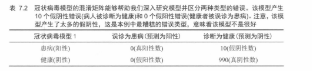
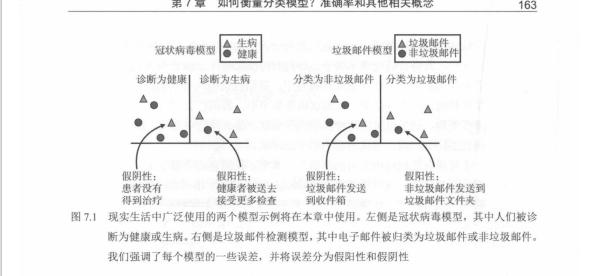
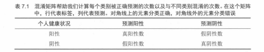

# 01. 如何衡量分类模型？准确率和其他相关概念

本节与前两章不同：这里不再关注「如何构建分类模型」，而是关心**如何评估分类模型的好坏**。  
对机器学习从业者来说，**能否正确评估模型性能，几乎和能否训练出好模型一样重要**。我们往往会尝试多个模型（或多组超参数），如果没有一套合理的评估方法，就无法有根据地做选择。

---

## 本章在做什么：从“感觉准”到“说得清哪里不准”

前两章更像在回答：**模型怎么输出预测**（分数、概率、阈值、损失、训练）。  
这一章换一个视角：把模型当成**黑盒**，只看它在数据集上的输出结果，回答三个更“工程化”的问题：

1. **它错在哪？**（漏检还是误报？各有多少？）
2. **错得有多严重？**（只看准确率够不够？）
3. **哪种错更不能接受？**（业务代价不同 → 指标选择不同）

所以你会看到本章的主线基本是“先把错误拆开 → 再用不同指标描述错误结构 → 最后回到业务决策（阈值/代价）”。

### 你将依次遇到的概念（当作目录读）

- **假阳性 FP / 假阴性 FN**：两种典型错误方向（后面所有指标都能理解成在“惩罚”其中一种或两种）
- **混淆矩阵**：把 TP/FP/TN/FN 放到一张表里，让错误结构一眼可见
- **Precision / Recall / F1**：在“报得准”和“找得全”之间做权衡时常用
- **Specificity / FPR**：更关注负类有没有被误报成正类（ROC 视角）
- **ROC / PR / AUC**：当你还不确定最终阈值，或数据极不平衡时，用来更全面地比较模型

### 两个贯穿全章的例子（用来对齐直觉）

- **医疗筛查**：正类稀有、漏诊代价高（“找病人”更重要）
- **垃圾邮件**：类别比例不同、误报代价也不同（“别误伤正常邮件”可能更重要）

### 7.1 准确率：模型的正确频率是多少（详解 + 笔记版）

准确率（accuracy）是分类模型最直观、最常用的评估指标：

`accuracy = 正确预测的样本数 / 总样本数`

它回答的问题只有一个：**模型整体“猜对”的比例有多高**。  
比如：1000 个测试样本里预测对了 875 个，则：

`accuracy = 875 / 1000 = 0.875` → **87.5%**

顺手也定义 **error_rate（错误率）**：

`error_rate = 1 - accuracy`

#### 准确率的致命缺陷：样本不平衡时会“看起来很强”

本节的关键点是：**准确率不区分错误类型**，因此在类别极不平衡的场景里会被“无脑猜多数类”刷得很高。

一个典型的极端例子（医疗筛查）：

- 总样本：1000 人，其中 **10 人患病（正类）**、**990 人健康（负类）**
- 模型：把所有人都预测为“健康”
- 结果：
  - 正确预测：990（真负例 TN）
  - 错误预测：10（假负例 FN，漏诊）
  - `accuracy = 990 / 1000 = 99%`

这类模型的准确率很高，但在医疗场景里几乎**没有实用价值**：它漏掉了全部病人。  
所以你要记住一句话：**高准确率不等于模型真的在做稀有事件检测。**

#### 为什么这会引出后面的指标？

准确率的核心缺陷是：把 **假阳性（FP，误报）** 与 **假阴性（FN，漏检）** 当成同一种错误。  
但在真实业务里，它们代价可能完全不同：

- **医疗筛查**：漏诊（FN）代价更高（宁可多复查，也不要漏掉病人）
- **垃圾邮件**：误杀（FP）代价更高（不想把正常邮件错删）

因此接下来我们需要先引入**混淆矩阵**把错误拆开（TP/FP/TN/FN），再用 **precision / recall / F1 / ROC / PR** 等指标描述“错得是什么类型、错得有多严重”。

---

## 混淆矩阵：把「预测结果」拆开看

以二分类为例（正类 positive / 负类 negative），我们可以把模型在测试集上的表现统计成一个 **2×2 表格**——**混淆矩阵（confusion matrix）**：

- **真正例（TP, true positive）**：真实为正类，预测也为正类。
- **假正例（FP, false positive）**：真实为负类，却被预测为正类。
- **真负例（TN, true negative）**：真实为负类，预测也为负类。
- **假负例（FN, false negative）**：真实为正类，却被预测为负类。

### 7.2 如何解决准确率问题？先分清“误报”和“漏检”

准确率会骗人，根子在于：它把所有错误都当成同一种错。解决办法是先把错误拆成两类方向：

- **假阳性（FP）**：把负类错当成正类（误报/误检）
- **假阴性（FN）**：把正类错当成负类（漏检/漏诊）

为了让你能把定义和业务直觉对齐，可以用两组贯穿例子来“落地”：

| 术语 | 通俗说法 | 定义（新人版） | 医疗筛查（新冠/疾病） | 垃圾邮件过滤 |
|---|---|---|---|---|
| **TP** | 找对了 | 真实是正类，预测也是正类 | 病人被判为患病 | 垃圾邮件被判为垃圾 |
| **TN** | 没搞错 | 真实是负类，预测也是负类 | 健康人被判为健康 | 正常邮件被判为正常 |
| **FP** | 误报 | 真实是负类，却预测成正类 | 健康人被误诊（多做检查） | 正常邮件被误删（很糟） |
| **FN** | 漏检 | 真实是正类，却预测成负类 | 病人被放走（很糟） | 垃圾邮件被漏掉 |

有了这四个数，就能写出一系列常见指标：

- **准确率**：`Acc = (TP + TN) / (TP + TN + FP + FN)`
- **错误率**：`Err = (FP + FN) / (TP + TN + FP + FN)`

但更重要的是，混淆矩阵能让我们看到**不同类型错误**的数量，这一点在很多应用中比整体准确率更关键。

---

## 召回率（Recall）与精确率（Precision）

- **召回率（recall / sensitivity / true positive rate, TPR）**  
  `Recall = TP / (TP + FN)`  
  含义：在所有真实为正的样本中，有多大比例被模型「找出来」。**越高表示漏检越少**。

- **精确率（precision / positive predictive value, PPV）**  
  `Precision = TP / (TP + FP)`  
  含义：在所有被模型预测为正的样本中，有多大比例是真的正类。**越高表示误报越少**。

二者构成了一种典型的**权衡**：

- 把模型阈值调得「更激进」、更容易预测为正类 → **召回率↑，精确率可能↓**（多抓病人，也多误报健康人）。
- 把阈值调得「更保守」、不轻易预测为正类 → **精确率↑，召回率可能↓**（报出的病人大多是真的，但漏掉了不少）。

在实际应用中，通常要先想清楚：**我们更怕哪一种错误？**

- 医疗筛查中往往更重视**召回率**（宁可多一些复查，也不要漏诊）。
- 垃圾邮件过滤中可能更重视**精确率**（不想把正常邮件错删）。

---

## F1 分数：在精确率与召回率之间折中

有时希望用一个数字同时概括「精确率和召回率都不错」。  
最常见做法是使用 **F1 分数（F1-score）**，即精确率与召回率的**调和平均数**：

`F1 = 2 * Precision * Recall / (Precision + Recall)`

特点：

- 若精确率或召回率其中之一非常低，F1 会被拖得很低（调和平均会惩罚极端不平衡）。
- 适合在**关注「正类」质量**、又不想只看某一个指标的情况下使用。

在多分类问题中，常见做法是对每个类别分别计算精确率、召回率、F1，然后用**宏平均（macro）**或**加权平均（weighted）**得到一个全局数值。

### F-beta：当你更偏向“别漏掉”或“别误报”时

有时你并不想让 precision 和 recall 同权，而是想“偏科”：

- 更怕漏检（FN）→ 更看重 recall
- 更怕误报（FP）→ 更看重 precision

这时可以用 **F-beta**（把权重交给一个参数 `beta`）：

`F_beta = (1 + beta^2) * P * R / (beta^2 * P + R)`

- `beta = 1`：就是 `F1`（precision 与 recall 同等重要）
- `beta > 1`：更看重 recall（医疗筛查、反欺诈预警等）
- `beta < 1`：更看重 precision（垃圾邮件过滤、精准推送等）

---

## 特异度（Specificity）与假正率（FPR）

除了「正类找得好不好」（召回率），我们还关心「负类有没有被错报为正类」。  
这对应两个常见指标：

- **特异度（specificity / true negative rate, TNR）**  
  `Specificity = TN / (TN + FP)`  
  含义：在所有真实为负的样本中，有多少比例被正确预测为负。

- **假正率（false positive rate, FPR）**  
  `FPR = FP / (TN + FP) = 1 - Specificity`

在很多安全类任务（如信用卡欺诈检测）中，FPR 直接关系到**误报成本**：FPR 太高会让系统不停地「误报警」，严重影响用户体验或运营成本。

---

## 阈值与评分：从「概率」到「预测标签」

许多分类模型（如逻辑回归、神经网络、树模型）本质上给出的是**对每个样本属于正类的「打分」或「概率」**，例如：

- `p(x)` 表示模型对样本 `x` 属于正类的估计概率。

为了得到最终的「正 / 负」标签，需要选定一个**阈值（threshold）**：

- 若 `p(x) >= τ`，预测为正类；
- 若 `p(x) < τ`，预测为负类。

默认阈值常常取 0.5，但在**类不平衡**或**错报代价不同**的场景中，这个默认值往往并不合适。  
通过移动阈值 `τ`，我们可以在「召回率 vs 精确率」「TPR vs FPR」之间得到不同的组合，这正是 **ROC 曲线** 和 **PR 曲线** 要表达的内容。

---

## ROC 曲线与 AUC

**ROC（receiver operating characteristic）曲线**最初用于雷达信号处理，后来广泛用于机器学习中的分类评估。  
核心思想：**随着决策阈值从「非常严格」到「非常宽松」连续改变，观察 TPR 与 FPR 如何变化。**

- 横轴：**FPR（假正率）**
- 纵轴：**TPR（召回率）**
- 每一个不同的阈值对应 ROC 图上的一个点；把所有点连起来就得到 ROC 曲线。

理想情况：

- 一个随机瞎猜的分类器，其 ROC 曲线大致在对角线附近（TPR ≈ FPR，没什么区分能力）。
- 一个好的分类器，曲线会尽量**向左上角凸起**：在保持较低 FPR 的同时获得较高 TPR。

**AUC（area under the curve）** 是 ROC 曲线下的面积，数值范围在 **0～1**（包含端点 0 和 1）：

- AUC = 0.5：与随机猜测差不多。
- AUC 越接近 1：说明模型越有区分正负样本的能力。

与单一阈值下的准确率不同，**AUC 相当于对所有可能阈值综合评估模型排序能力**，因此在不清楚最终阈值、或者更关心排序效果时，AUC 是一个非常常用的指标。

---

## PR 曲线：在极度不平衡时更直观

当正类非常少时（如万分之一是欺诈、罕见病等），**PR 曲线（Precision-Recall curve）**往往比 ROC 更有解释力：

- 横轴：**Recall（召回率）**
- 纵轴：**Precision（精确率）**

含义：随着阈值变化，我们在「多找一些正类」（Recall↑）的同时，「预测为正的样本里有多少是对的」（Precision）的关系如何变化。  
在正类稀少的情况下，一个看似不错的 ROC 曲线仍可能对应很低的 precision，而 **PR 曲线会直接表现出这一点**。

很多实际项目中，在模型迭代阶段会同时看：

- ROC-AUC：衡量整体排序能力；
- PR 曲线：关注在高召回区间时精确率是否仍然可接受。

---

## 代价敏感学习与加权指标

在一些应用中，不同类型错误的代价相差极大，例如：

- 医疗：漏诊（FN）的代价 > 误诊（FP）。
- 金融反欺诈：过多的 FP 会造成巨大的运营成本和用户抱怨。

这时，仅看「准确率 / F1 / ROC-AUC」并不能完全反映业务需求，需要：

- 在训练时引入**类别权重**（class weights），让模型在损失函数中对某类错误惩罚更重；
- 在评估时使用**加权准确率、加权 F1**，或者直接设计**自定义代价函数**（例如把 FN 算作 10 分错、FP 算作 1 分错）。

从更高层看：  
**机器学习的目标不只是「分得准」，而是「在真实业务代价下表现最好」**。

---

## 多分类与 Top-k 指标

前面的大部分讨论以二分类为例，但在多分类任务（如图像识别、文本分类）中思路类似：

- 可以对每个类别单独当作「正类 vs 其他」来计算 TP/TN/FP/FN；
- 再做**宏平均（macro）**或**加权平均（weighted / micro）**，得到整体指标。

在类别很多、且每次预测只关心「正确类别是否出现在前 k 个候选」时，还会用到：

- **Top-1 准确率**：预测概率最高的类别是否为真值。
- **Top-k 准确率**：真值是否出现在概率最高的前 k 个类别中（如图像识别常用 Top-5）。

这些指标更贴近某些实际应用的需求，如推荐系统中「用户是否点开推荐列表里的某一个项目」，而不是列表中的第一项是否正好命中。

---

## 概率质量与对数损失（Log-loss）

前述指标大多只看「分对 / 分错」，不关心模型给出的**概率是否可靠**。  
例如：  
两个模型都把某病人预测为「阳性」，一个给出 0.51，另一个给出 0.99，从准确率角度看完全一样，但在决策上含义非常不同。

衡量「概率预测」好坏的常见指标是**对数损失（log-loss / cross-entropy loss）**：

- 若真实标签为 1，预测概率为 `p`，损失为 `-ln(p)`；
- 若真实标签为 0，预测概率为 `p`，损失为 `-ln(1 - p)`；
- 对整个数据集取平均。

特点：

- 对「自信但错得离谱」的预测惩罚非常大（如真实为 0 却预测 0.999 为 1）。
- 鼓励模型给出**校准良好**的概率，而不仅仅是把正类排在负类前面。

在很多深度学习分类任务中，训练目标本身就是最小化交叉熵损失，因此用 **log-loss / cross-entropy** 在验证集上做模型选择也十分自然。

---

## 小结：如何为任务选择评估指标

综合本节内容，可以形成一个简单的思考流程：

- **类别是否极度不平衡？**  
  - 否 → 准确率 + 混淆矩阵通常就够用，再配合精确率 / 召回率 / F1。  
  - 是 → 更关注精确率、召回率、F1、PR 曲线，谨慎解读准确率。

- **哪种错误代价更高？**  
  - 漏检代价更高 → 优先追求高召回率（或相关加权指标）。  
  - 误报代价更高 → 优先追求高精确率或低 FPR，并适当调整阈值。

- **是否关心排序能力或阈值尚未确定？**  
  - 使用 ROC 曲线与 AUC。

- **是否关心预测概率本身是否可靠？**  
  - 使用 log-loss、校准曲线等概率质量指标。

最终目标不是「把某个指标拉到多高」，而是：**在清楚业务需求和约束的前提下，选择合适的评估指标，并据此做出好的模型与阈值决策**。

