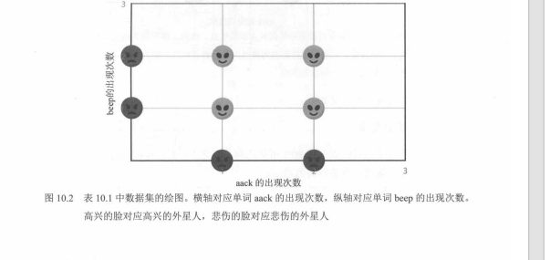
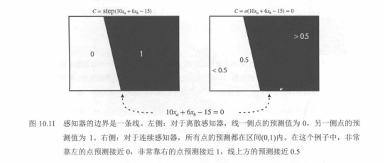
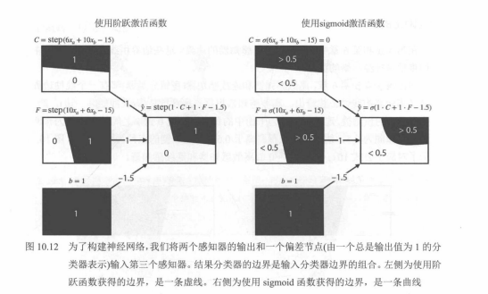
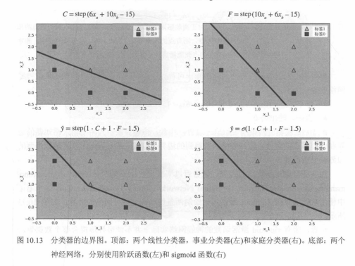
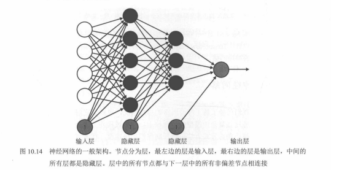
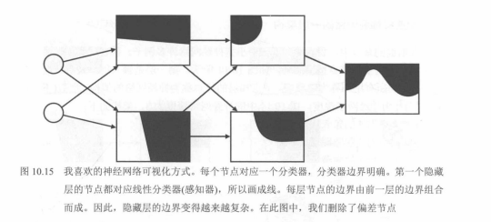

# 02. 神经网络入门：从感知机到复杂边界（定稿阅读版）

在机器学习中，很多现实问题无法用一条直线分开，这类问题叫作**线性不可分问题**，需要用神经网络来解决。本章通过外星人情感分类的例子，一步步理解神经网络的工作原理。

下列 **图 10.2～图 10.15** 的配图已放在 `images/`，文内按顺序嵌入；**图 10.8、图 10.9、图 10.10** 在教材中常印在同一页，本仓库用 **一张截图**覆盖三图。

---

## 一、线性不可分问题

我们根据外星人词语 `aack` 和 `beep` 的出现次数，判断它是高兴还是悲伤。

数据分布特点：

- 只出现一种词语 → 悲伤  
- 两种词语同时出现 → 高兴  

这类数据无法用一条直线分开，是典型的**非线性**问题。

**对应图示：图 10.2**

---

## 二、用多条直线组合解决问题

单个线性分类器不够，我们可以用**两条直线**分别划分数据，再把结果组合起来。只有同时满足两个条件，才判定为高兴，否则为悲伤。

**对应图示：图 10.3**

---

## 三、逻辑组合：AND 运算

将两条直线的判断结果用**“与（AND）”逻辑**组合，实现更复杂的判断规则。这是神经网络实现复杂决策的基础思路。

**对应图示：图 10.4**

---

## 四、感知机：神经网络的基本单元

感知机是神经网络的最小组成部分，包含输入、权重、偏置和激活函数，模拟生物神经元的工作方式。

**对应图示：图 10.6、图 10.7**

---

## 五、神经元连接形成神经网络

把多个感知机按层次连接，前一层输出作为后一层输入，就构成了完整的神经网络结构。

**对应图示：图 10.8、图 10.9、图 10.10（教材常同页；下图为同页截图）**

---

## 六、单个感知机的分类边界

单个感知机只能生成**一条直线边界**，无法处理非线性数据。

**对应图示：图 10.11**

---

## 七、多个感知机组合后的边界

多个感知机组合后，边界从直线变为**折线或封闭区域**（用 sigmoid 时还可更光滑），可以解决这类简单非线性问题。

**对应图示：图 10.12**

---

## 八、效果对比：线性模型 vs 神经网络

上方是单个线性分类器，无法分开数据；下方是神经网络，能够划分两类样本。

**对应图示：图 10.13**

---

## 九、标准全连接神经网络结构

典型神经网络分为三层：

- **输入层**：接收原始特征（常含偏置节点）；  
- **隐藏层**：进行特征组合与非线性变换；  
- **输出层**：输出分类结果。  

每层神经元与下一层**全部相连**（对非偏置节点），称为**全连接**网络。

**对应图示：图 10.14**

---

## 十、神经网络逐层构建复杂边界

神经网络通过层级学习，从简单直线逐步组合成折线、更复杂的区域，最终形成表达能力很强的分类边界，这也是深度学习强大的直观原因之一。

**对应图示：图 10.15**

---

## 配图清单（按文章顺序）

| 顺序 | 图号 | 仓库文件 |
|------|------|----------|
| 1 | 图 10.2 | `images/fig10.2-linear-inseparable-alien-emotions.png` |
| 2 | 图 10.3 | `images/fig10.3-two-lines-separate-alien-classes.png` |
| 3 | 图 10.4 | `images/fig10.4-happiness-classifier-and-gate.png` |
| 4 | 图 10.6 | `images/fig10.6-neuron-vs-perceptron.png` |
| 5 | 图 10.7 | `images/fig10.7-perceptron-visual-sigmoid.png` |
| 6 | 图 10.8、10.9、10.10 | `images/fig10.8-10.10-network-from-perceptrons.png`（同一张） |
| 7 | 图 10.11 | `images/fig10.11-single-perceptron-line-boundary.png` |
| 8 | 图 10.12 | `images/fig10.12-combined-perceptrons-polyline-region.png` |
| 9 | 图 10.13 | `images/fig10.13-perceptron-vs-neural-network-boundary.png` |
| 10 | 图 10.14 | `images/fig10.14-mlp-standard-architecture.png` |
| 11 | 图 10.15 | `images/fig10.15-layerwise-complex-boundary.png` |

**说明**：教材中的**表 10.2**、**图 10.5**（逐步数值表）仍保留在仓库 `images/table10.2-two-formulas-and-and-column.png`、`images/fig10.5-three-perceptron-tables-career-family-happiness.png`，若你需要「公式推导版」笔记可另开一篇或从 Git 历史恢复长版 `02`。

后续（训练与正则，**图 10.16～10.19**）：`03.训练直觉：反向传播、梯度消失、Dropout与激活函数.md`
