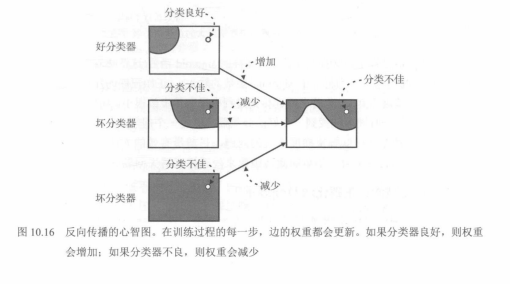
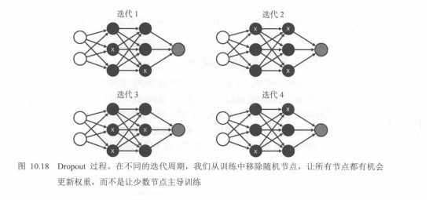
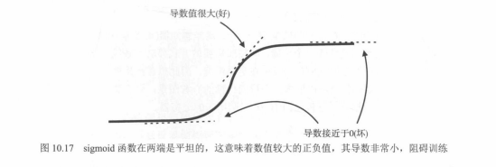
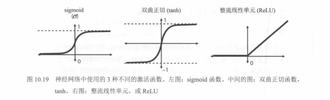

# 04. 神经网络 10.2 节：训练与优化（配图版）

本节对应《机器学习图解》**第 10.2 节：神经网络训练与优化**，按「从原理到实践、从问题到解决方案」组织。**图 10.16～图 10.19** 已在仓库 `images/` 中，文内直接引用；教材**开篇页（训练流程 + 对数损失）**、**Softmax 数值示例**、**超参数清单页**若你手边有书，请按文末文件名各截一张图放入同目录即可显示。

更简的图注版见：`03.训练直觉：反向传播、梯度消失、Dropout与激活函数.md`（仅 10.16～10.19）。

---

## 一、神经网络训练的核心流程

训练神经网络的逻辑与感知机、逻辑回归一致，可概括为三步：

1. **随机初始化**：为所有权重与偏置赋随机初值（具体分布依实现而定）。  
2. **定义误差（损失）函数**：用损失衡量预测与标签的差距。  
3. **迭代优化**：**反向传播**求梯度，**梯度下降**更新参数，使损失下降。

**对应教材**：10.2 节开篇页（训练三步总览）。

**配图**：将教材该页截图保存为 `images/fig10.2-sec-opening-training-flow.png` 后，可在上一段下插入：

``

---

## 二、误差函数：对数损失（Log Loss / 交叉熵）

二分类且输出为「正类概率」`y_hat` ∈ `(0, 1)` 时，常用**对数损失**（与交叉熵在伯努利情形下形式一致）：

`log_loss = -y * ln(y_hat) - (1 - y) * ln(1 - y_hat)`

- `y`：真实标签（0 或 1）  
- `y_hat`：模型预测的概率  

**性质（直觉）**：预测与标签越一致，损失越接近 0；差距越大，损失越大。

**对应教材**：通常与「训练流程」同在 10.2 节前几页（可与开篇共用一张截图；若单独成页，可另存为 `images/fig10.2-sec-logloss.png`）。

---

## 三、反向传播：训练的核心步骤

反向传播是**多层网络**上梯度下降的实现方式：用链式法则从输出层向输入层逐层计算损失对每个权重、偏置的**偏导数**，再按学习率更新参数。

**伪代码思路**：

1. 随机初始化网络参数。  
2. 重复多轮：  
   - 前向算预测与损失；  
   - 反向算各层梯度；  
   - 沿梯度反方向更新权重与偏置。  
3. 损失足够小或达到轮数上限则停止。

**直观理解（图 10.16）**：对当前样本「有帮助」的路径加大权重，「帮倒忙」的路径减小权重，多步之后整体预测变好。

**对应图示：图 10.16**

---

## 四、训练中的两大问题与对策

### 1. 过拟合

**现象**：训练集很好、测试集变差，模型「记住」噪声与细节。

**常见手段**：

- **L1 / L2 正则化**：在损失上增加对权重的惩罚项，抑制权重大幅波动；L1 倾向稀疏，L2 更常用。  
- **Dropout（图 10.18）**：训练时随机让部分神经元不参与前向与反向，减轻「少数神经元包办」的过拟合；推理时常用缩放或平均策略与训练分布对齐（以教材与框架为准）。

**对应图示：图 10.18**

---

### 2. 梯度消失

**现象**：深层网络中，若隐藏层多用 **sigmoid** 且输入落入两端饱和区，局部导数接近 0，反向传播时梯度连乘后迅速变小，**前面层几乎学不动**。

**对应图示：图 10.17**

**常见对策**：换用更利于梯度的激活（**ReLU** 及其变体在隐藏层非常常见）；**tanh** 相对 sigmoid 也常略有改善，但深层仍以 ReLU 系为主流。三者形状对比见 **图 10.19**。

**对应图示：图 10.19**

---

## 五、多分类输出：Softmax

`K` 类分类时，输出层常先得到 `K` 个**未归一化分数** `z_1, …, z_K`，再经 **Softmax** 变成和为 1 的概率：

`p_i = exp(z_i) / (exp(z_1) + … + exp(z_K))`

- 每个 `p_i` 可解释为「属于第 i 类的模型概率」；预测类别常取 `argmax_i(p_i)`。  
- 教材中的**四分类示例**（如土豚 / 鸟 / 猫 / 狗）可将该页截图存为下方文件名。

> 若文件尚不存在：保存为 `images/fig10.2-sec-softmax-example.png`。

---

## 六、超参数一览

超参数需在训练前设定，直接影响效果与稳定性，例如：

| 类别 | 例子 | 作用 |
|------|------|------|
| 优化 | 学习率 `η` | 梯度下降每步步长 |
| 优化 | 迭代轮数 / epoch | 训练多久 |
| 优化 | batch / mini-batch 大小 | 每步用多少样本算梯度 |
| 结构 | 层数、各层神经元数 | 容量与表达能力 |
| 结构 | 激活函数种类 | 非线性形状与梯度行为 |
| 正则 | L1/L2 强度 `λ` | 抑制过拟合 |
| 正则 | Dropout 概率 `p` | 随机失活比例 |

**对应教材**：超参数汇总页。截图建议保存为 `images/fig10.2-sec-hyperparameters.png`。

---

## 配图与文件对照（10.2 节）

| 顺序 | 内容 | 仓库文件 |
|------|------|----------|
| 开篇 | 训练三步 + 可与对数损失同页 | `fig10.2-sec-opening-training-flow.png`（待补） |
| 核心图 | 反向传播心智图 | `fig10.16-backprop-mental-map.png` |
| 核心图 | sigmoid 与梯度消失 | `fig10.17-sigmoid-vanishing-gradient.png` |
| 核心图 | Dropout | `fig10.18-dropout-process.png` |
| 核心图 | 三种激活函数 | `fig10.19-activation-functions-sigmoid-tanh-relu.png` |
| 可选 | Softmax 示例 | `fig10.2-sec-softmax-example.png`（待补） |
| 可选 | 超参数表 | `fig10.2-sec-hyperparameters.png`（待补） |

---

## 极简总结

- 训练主线：**初始化 → 定义损失（如 log loss）→ 反向传播 + 梯度下降**。  
- 过拟合：**L1/L2**、**Dropout** 等。  
- 梯度消失（sigmoid 饱和）：优先在隐藏层换 **ReLU** 等；**图 10.17、10.19** 对照阅读。  
- 多分类：**Softmax** 输出概率分布。  
- 实际效果强依赖**超参数**（学习率、结构、正则、Dropout 等）。
