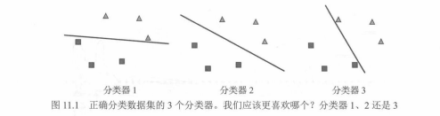
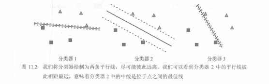

# 01. 支持向量机简介：最大间隔直觉

本章将学习一个强大的分类模型：**支持向量机（support vector machine, SVM）**。  
SVM 可以像感知器一样用一条**线性边界**把数据分成两类，但它的目标不只是“分对”，而是要在所有能正确分开的直线中，找到**泛化更好的那一条**。

本章还会介绍**内核方法（kernel methods）**：用更高维的“变换视角”，把原本线性不可分的问题转化为线性可分，从而让 SVM 能处理更复杂的分类边界。

---

## 同样都能分开：该选哪条线？

回顾第 5 章的线性分类器（感知器）：在二维数据中，我们用一条线把两类点分开。  
但一个常见现象是：**能把训练数据分开的直线往往不止一条**。那么问题来了：

> 当多条直线都能正确分类训练数据时，我们该怎么选择“更好”的那条？

图 11.1 给出了 3 个分类器（3 条直线），它们都能把数据分开。直觉上，**分类器 2 更值得选择**：它离两类数据都更“远”，而分类器 1 和 3 的直线贴近了一些点。

---

## 为什么“离得更远”更好：对扰动更鲁棒

假设我们把这 3 条直线都稍微挪动一下（数据有噪声、测量误差、或者未来样本略有偏移）：

- 对分类器 1 和 3：因为直线离某些点很近，稍微移动就可能**越过一些点**，从而造成误分类。
- 对分类器 2：因为它离所有点更远，小幅移动后仍然可能保持正确分类。

因此，分类器 2 往往具有更好的**稳定性/鲁棒性**，也更可能在没见过的数据上表现更好。

---

## SVM 的核心想法：最大化“间隔”（margin）

SVM 的关键在于**间隔（margin）**的概念。与“只找一条分割线”不同，SVM 更像是在找一个“安全通道”：

- 用两条与分割线平行的直线把两类数据隔开
- 并让这两条平行线之间的距离尽可能大

图 11.2 把上述「两条平行线」画成**虚线边界**：三条候选直线里，**分类器 2** 的两条虚线相距最远，即**间隔最大**，中间实线即为最大间隔意义下的最优分割。

换句话说，SVM 的目标是双重的：

- **正确分类**训练数据
- 让分割边界与最近的样本点之间的距离尽可能大（即 **最大间隔**）

“间隔最大”的分类器，通常就是图 11.1 中最接近分类器 2 的那种：**分割线居中、离两类都尽量远**。

这些“最靠近边界”的训练样本点，会在后续推导中变得非常重要：它们决定了最优间隔的位置，因此被称为**支持向量（support vectors）**。

