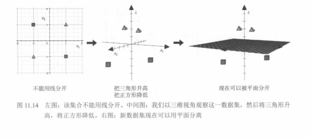
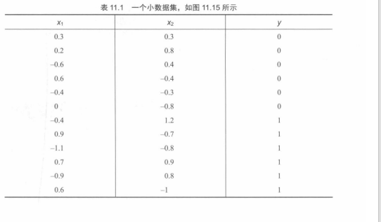
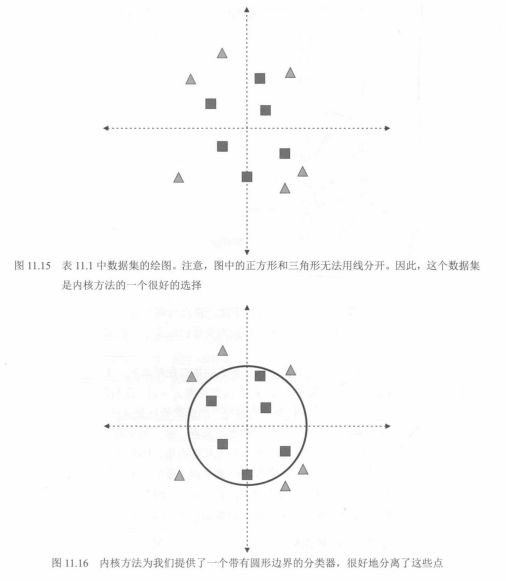
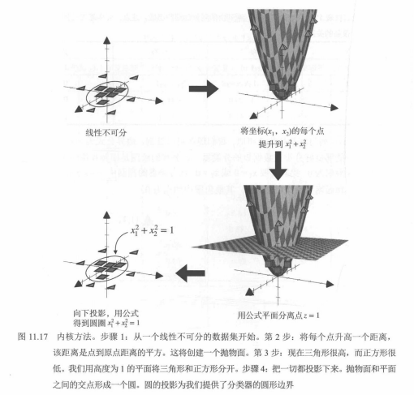
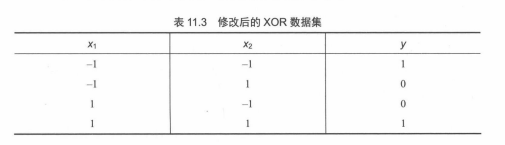
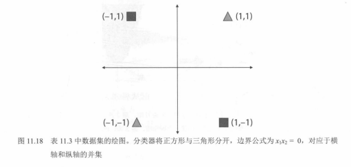

# 04. 核方法、`C` 与特征映射（图 11.13～11.19，表 11.1～11.5）

在 `03.近线性可分与线性SVM：图11.11至11.12.md` 中，我们看到线性 SVM 在「近线性可分」数据上的行为。本节接续教材：**调节正则化参数 `C`**、**升维与核技巧**的直觉，以及**表 11.1～11.5** 给出的若干小数据集（含 XOR、圆环可分、多项式特征）。公式与特征名仍用反引号书写。

---

## 图 11.13：`C` 小 vs `C` 大（软间隔 ↔ 贴近训练点）

在同一批二维数据上，**线性**分类器（如线性 SVM）的决策线随 **`C`** 变化：

- **`C = 0.01`（小）**：更强调**宽间隔 / 强正则**，允许更多训练点落在间隔带内或被错分；准确率示例约 **0.867**，边界相对「宽松」。
- **`C = 100`（大）**：更强调**少犯错**，决策边界更用力去分开训练点，准确率示例约 **0.917**，但线可能**贴某些点很近**（高方差、易过拟合风险）。

在 `sklearn.svm.SVC` 中，**`C` 越大**通常表示对**间隔违反（松弛）**惩罚越重，与「软间隔」一节的思想一致：在**泛化**与**拟合训练集**之间做折中。

---

## 图 11.14：二维不可分 → 三维用平面分开（核技巧的直觉）

左图：四类角点呈 **XOR 式**排布，**一条直线**无法分开两类。  
中图：把点映射到三维（示意「抬高 / 压低」不同类）。  
右图：在新空间里用**一张平面**即可分开——对应「**非线性边界** = 原空间中对高维**线性超平面**的原像」这一核心直觉。

---

## 表 11.1：小数据集（对应图 11.15）

教材用 **12** 个二维点，前 6 个标签 `y=0`，后 6 个 `y=1`（见下图与下表）。

| `x1` | `x2` | `y` |
|------|------|-----|
| 0.3 | 0.3 | 0 |
| 0.2 | 0.8 | 0 |
| -0.6 | 0.4 | 0 |
| 0.6 | -0.4 | 0 |
| -0.4 | -0.3 | 0 |
| 0 | -0.8 | 0 |
| -0.4 | 1.2 | 1 |
| 0.9 | -0.7 | 1 |
| -1.1 | -0.8 | 1 |
| 0.7 | 0.9 | 1 |
| -0.9 | 0.8 | 1 |
| 0.6 | -1 | 1 |

---

## 表 11.2：在表 11.1 上增加 `x1^2 + x2^2`

新列是到原点距离平方，便于在三维中用**高度**区分「内圈 / 外圈」类（与图 11.17 的抛物面直觉一致）。

| `x1` | `x2` | `x1^2 + x2^2` | `y` |
|------|------|----------------|-----|
| 0.3 | 0.3 | 0.18 | 0 |
| 0.2 | 0.8 | 0.68 | 0 |
| -0.6 | 0.4 | 0.52 | 0 |
| 0.6 | -0.4 | 0.52 | 0 |
| -0.4 | -0.3 | 0.25 | 0 |
| 0 | -0.8 | 0.64 | 0 |
| -0.4 | 1.2 | 1.6 | 1 |
| 0.9 | -0.7 | 1.3 | 1 |
| -1.1 | -0.8 | 1.85 | 1 |
| 0.7 | 0.9 | 1.3 | 1 |
| -0.9 | 0.8 | 1.45 | 1 |
| 0.6 | -1 | 1.36 | 1 |

---

## 图 11.15～11.16：表 11.1 的散点与圆边界分类器

- **图 11.15**：方格在**原点附近**，三角在**外圈**——**无法用一条直线**分开，适合作为**核方法**示例。
- **图 11.16**：核方法给出**圆形决策边界**，内 / 外对应两类，与 `x1^2 + x2^2` 阈值化思想一致。

---

## 图 11.17：核方法（抛物面 + 平面 `z=1` → 圆）

流程：**线性不可分** → 将 `(x1, x2)` 提升到 `z = x1^2 + x2^2`（抛物面）→ 在 **z=1** 处用**平面**分开两类 → **投影回二维**得到 **`x1^2 + x2^2 = 1`** 的圆决策边界。

---

## 表 11.3：修改后的 XOR 数据集

输入取 `{-1, 1}`，标签为 **XNOR**（同号为 1，异号为 0）。二维中**不可线性可分**。

| `x1` | `x2` | `y` |
|------|------|-----|
| -1 | -1 | 1 |
| -1 | 1 | 0 |
| 1 | -1 | 0 |
| 1 | 1 | 1 |

---

## 表 11.4：在表 11.3 上增加列 `x1 * x2`

新列与 `y` 强相关：`x1*x2 = 1` 时 `y=1`，`x1*x2 = -1` 时 `y=0`，因而在**三维特征** `(x1, x2, x1*x2)` 中线性可分。

| `x1` | `x2` | `x1*x2` | `y` |
|------|------|---------|-----|
| -1 | -1 | 1 | 1 |
| -1 | 1 | -1 | 0 |
| 1 | -1 | -1 | 0 |
| 1 | 1 | 1 | 1 |

---

## 图 11.18：表 11.3 的绘图与边界 `x1*x2 = 0`

教材示意：用 **`x1*x2 = 0`**（**两坐标轴的并集**）描述分界结构——与「乘积符号」刻画 XOR/XNOR 的直觉一致（具体绘图与课堂定义可能略有出入，以原书为准）。

---

## 表 11.5：在表 11.1 上增加二次单项式 `x1^2`、`x1*x2`、`x2^2`

即 `x3=x1^2`、`x4=x1*x2`、`x5=x2^2`，把二阶多项式特征显式写出，便于与**线性模型在高维特征空间里等价于原空间非线性边界**对照。

| `x1` | `x2` | `x1^2` | `x1*x2` | `x2^2` | `y` |
|------|------|--------|---------|--------|-----|
| 0.3 | 0.3 | 0.09 | 0.09 | 0.09 | 0 |
| 0.2 | 0.8 | 0.04 | 0.16 | 0.64 | 0 |
| -0.6 | 0.4 | 0.36 | -0.24 | 0.16 | 0 |
| 0.6 | -0.4 | 0.36 | -0.24 | 0.16 | 0 |
| -0.4 | -0.3 | 0.16 | 0.12 | 0.09 | 0 |
| 0 | -0.8 | 0 | 0 | 0.64 | 0 |
| -0.4 | 1.2 | 0.16 | -0.48 | 1.44 | 1 |
| 0.9 | -0.7 | 0.81 | -0.63 | 0.49 | 1 |
| -1.1 | -0.8 | 1.21 | 0.88 | 0.64 | 1 |
| 0.7 | 0.9 | 0.49 | 0.63 | 0.81 | 1 |
| -0.9 | 0.8 | 0.81 | -0.72 | 0.64 | 1 |
| 0.6 | -1 | 0.36 | -0.6 | 1 | 1 |

---

## 图 11.19：一维上「线性分类器」不可分

一维时，**线性分类器**对应一个**切分点**把数轴分成两段。若三角在 **-1** 与 **1**，方格在 **0**（夹在中间），则**不存在一个点**使两类各落一侧——与 XOR 类似，需要**非线性**或**特征变换**（例如升到 `x^2`）。

---

## 配图与配表清单

| 编号 | 文件 |
|------|------|
| 11.13 | `images/fig11.13-c-small-vs-large-margin.png` |
| 11.14 | `images/fig11.14-kernel-trick-xor-3d.png` |
| 11.15～11.16 | `images/fig11.15-11.16-circle-kernel-boundary.png` |
| 11.17 | `images/fig11.17-kernel-method-paraboloid.png` |
| 11.18 | `images/fig11.18-xor-decision-axes.png` |
| 11.19 | `images/fig11.19-1d-not-linearly-separable.png` |
| 表 11.1 | `images/table11.1-small-dataset.png` |
| 表 11.2 | `images/table11.2-sum-of-squares.png` |
| 表 11.3 | `images/table11.3-xor-dataset.png` |
| 表 11.4 | `images/table11.4-product-feature.png` |
| 表 11.5 | `images/table11.5-quadratic-monomials.png` |

下一节（**RBF 核**、一维决策函数叠加与图示，**图 11.20～11.24**）：`05.径向基函数与RBF核：图11.20至11.24.md`
