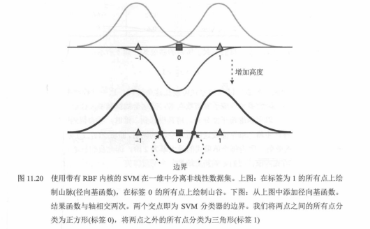
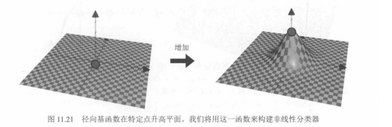
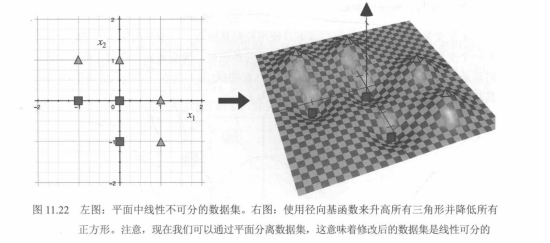
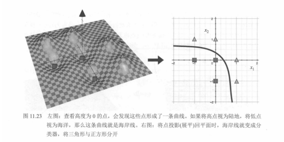
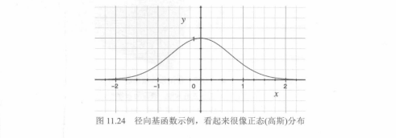

# 05. 径向基函数（RBF）与 RBF 核（图 11.20～11.24）

在 `04.核方法、C与特征映射：图11.13至11.19及表11.1至11.5.md` 中，我们用抛物面、多项式特征等说明了「升维后线性可分」。本节专门用 **RBF（径向基函数）核** 的图示：一维上如何用**高斯形**基函数叠加出**非线性决策**、二维平面上如何把点「抬高 / 压低」，以及 **RBF 曲线**与正态密度的相似性。与前几节一致，公式名用反引号书写。

---

## 图 11.20：一维数据上用 RBF 核 SVM 分开「夹心」两类

数据在数轴 **-1、0、1** 上：两侧为三角（标签 1），中间为方格（标签 0），与图 11.19 相同，**单点阈值**不可分。

- **上图**：在每个标签为 1 的点上叠「山丘」（径向基函数 `K(x, x_i)`），在标签为 0 的点上叠「谷」（可理解为带负号或相反符号的贡献）。
- **下图**：将各 RBF **相加**得到粗黑决策函数曲线；它与横轴有**两个交点**（图中标为「边界」）。
- **规则**：两边界**之间**（曲线在轴下方）判为方格（0），**之外**判为三角（1）。

这与 SVM 决策函数 `f(x) = sum_i alpha_i y_i K(x, x_i) + b` 的直觉一致：每个支持向量贡献一块局部「鼓包」，零水平集给出分界。

---

## 图 11.21：RBF 在一点处「顶起」平面

左图：二维输入平面（示意棋盘格）上有一点。右图：在该点施加 RBF 后，曲面在局部形成**对称鼓包**（钟形），类似高斯核 `exp(-gamma * ||x - c||^2)` 在中心 `c` 处的影响。多个这样的鼓包叠加，即可构造复杂的非线性分界面。

---

## 图 11.22：平面中线性不可分 → 用 RBF 抬高/压低后在三维中可分

左图：二维上三角与方格**不能**用一条直线完全分开。右图：用径向基函数把三角一侧**抬高**、方格一侧**压低**后，在三维中可用**一张平面**把两类分开——即隐式特征空间里**线性可分**，原平面上的边界则是非线性曲线。

---

## 图 11.23：高度为 0 的「海岸线」与投影回二维的分类曲线

左图：在扭曲的三维曲面上，三角在「高处」、方格在「低处」；高度为 **0** 的点连成一条**虚线海岸**。右图：把点压回 `x1`、`x2` 平面后，这条海岸的投影成为**弯曲的决策边界**，将两类分开。

---

## 图 11.24：径向基函数示例（形似高斯密度）

一维上典型的 RBF 形状：在 `x=0` 取峰值，向两侧快速衰减，整体与**正态（高斯）密度**的钟形曲线很像（具体尺度与 `gamma` 等参数有关）。实现上常用 `sklearn.svm.SVC(kernel='rbf', gamma=...)` 等，其中 `gamma` 控制鼓包**宽窄**。

---

## 配图清单

| 图号 | 文件 |
|------|------|
| 11.20 | `images/fig11.20-rbf-svm-1d.png` |
| 11.21 | `images/fig11.21-rbf-raise-plane.png` |
| 11.22 | `images/fig11.22-rbf-lift-2d-to-3d.png` |
| 11.23 | `images/fig11.23-coastline-zero-level.png` |
| 11.24 | `images/fig11.24-rbf-bell-curve.png` |
