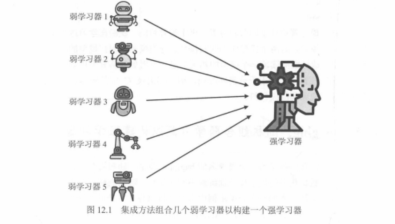
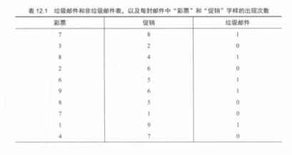
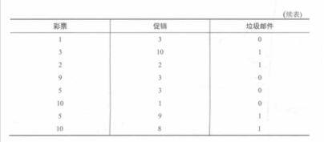
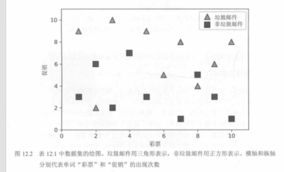
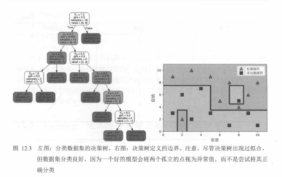
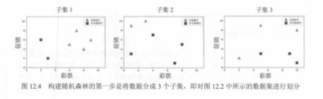
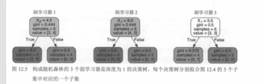

# 02. Bagging 与随机森林（图 12.1～12.5，表 12.1）

本节承接 `01.集成学习开篇.md`：用一组「垃圾邮件 / 非垃圾邮件」的小例子，说明 **Bagging** 如何通过**自助采样（bootstrap）**训练多棵树并投票；并用教材图 **12.1～12.5** 串起：数据表 → 散点图 → 单棵树的边界 → 抽样得到多个子集 → 多棵树投票组成随机森林。

---

## 图 12.1：多个弱学习器组合成强学习器（直觉图）

多位「学习者 / 朋友」各自给出判断，最后汇总为更稳健的整体预测——这就是集成学习的核心直觉（对应 Bagging 的“并行 + 汇总”）。

---

## 表 12.1：训练数据（示例特征）

教材用两个特征举例（如“彩票”“促销”字样出现次数），并标注是否为垃圾邮件。由于截图分两段保存，这里分 **part1 / part2** 插入。

---

## 图 12.2：把表 12.1 画成散点图

把两个特征作为 `x`、`y` 坐标绘图：三角表示垃圾邮件、方块表示非垃圾邮件。接下来若用一棵决策树，它会用轴对齐的切分得到“阶梯状”边界。

---

## 图 12.3：单棵决策树的边界（易受样本波动影响）

左侧是决策树结构，右侧是其在平面上的分类边界：边界呈矩形拼接，且可能对个别点非常敏感（方差较大）。这也是 Bagging / 随机森林要解决的问题之一：通过“多棵树 + 投票”降低不稳定性。

---

## 图 12.4：自助采样（bootstrap）生成多个训练子集

对原始训练集进行“有放回抽样”，可以得到多个大小相近但分布略有差异的子集。每个子集训练一棵树，树与树之间因数据不同而产生差异。

---

## 图 12.5：多棵树投票（随机森林的基本形式）

把多棵树的预测结果做**多数票**（分类）或平均（回归），得到更稳健的最终输出。随机森林通常还会在每次分裂时随机抽取一部分特征，以进一步降低树之间的相关性。

---

## 配图清单

| 编号 | 文件 |
|------|------|
| 12.1 | `images/fig12.1-ensemble-multiple-learners.png` |
| 12.2 | `images/fig12.2-scatter-spam-features.png` |
| 12.3 | `images/fig12.3-decision-tree-boundary.png` |
| 12.4 | `images/fig12.4-bootstrap-subsets.png` |
| 12.5 | `images/fig12.5-random-forest-3-trees.png` |
| 表 12.1（part1） | `images/table12.1-spam-features-part1.png` |
| 表 12.1（part2） | `images/table12.1-spam-features-part2.png` |

下一节（随机森林边界 + AdaBoost 重加权直觉，图 12.6～12.10）：`03.随机森林边界与AdaBoost直觉：图12.6至12.10.md`

