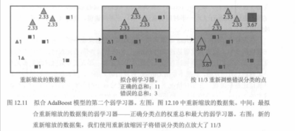
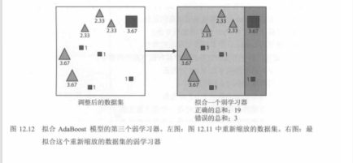
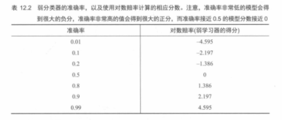
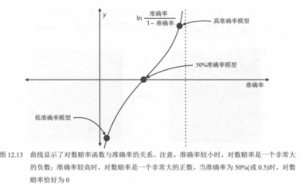
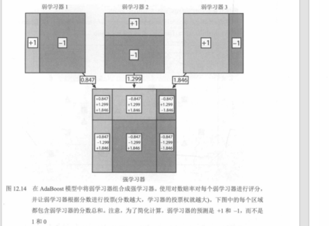
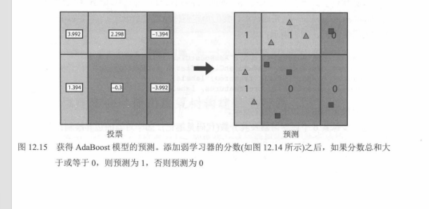
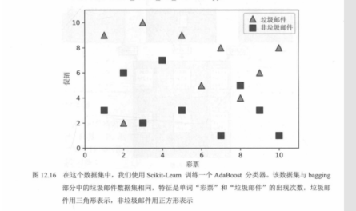
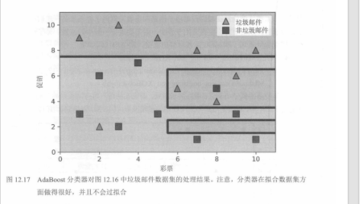
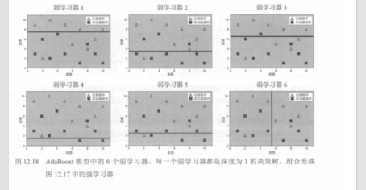

# 03. AdaBoost 原理：样本加权与串行提升

本节对应《机器学习图解》第 12 章中 **AdaBoost（Adaptive Boosting）** 的核心内容。它属于 **Boosting（提升法）** 家族，和随机森林最大的区别是：AdaBoost 不是“并行投票”，而是**一轮一轮地纠错**。

---

## 一、AdaBoost 是什么

- **全称**：Adaptive Boosting  
- **核心直觉**：**知错就改，专挑错的练**。  
- **训练方式**：串行。第 \(t+1\) 个弱学习器会关注前 \(t\) 轮还没处理好的样本。  
- **常见弱学习器**：深度为 1 的决策树（树桩）。  

与随机森林不同，AdaBoost 会不断调整样本权重：

- 分错的样本，权重升高  
- 分对的样本，权重降低或保持相对不重要  

这样下一轮模型就会更关注那些难点。

---

## 二、图文流程：12.10 → 12.12

## 图 12.10：第一轮训练与第一次重加权

开始时所有样本权重相同。训练第一个弱学习器后，把它分错的点放大，让这些点在下一轮变得“更重要”。

---

## 图 12.11：第二轮继续聚焦难样本

在重加权后的数据上训练第二个弱学习器。由于错分点被放大，新模型会更努力地去处理这些前一轮没分好的样本。

---

## 图 12.12：多个弱学习器加权组合

单个弱学习器能力有限，但当多个弱学习器按权重组合后，就能形成更强的整体分类器。

---

## 三、分数与“话语权”：对数赔率视角

AdaBoost 中，每个弱学习器不只是“投一票”，而是根据表现拿到不同的权重。  
教材后面用 **对数赔率（log-odds / logit）** 的方式解释：准确率高于 0.5 的模型应当得到正分，准确率低于 0.5 的模型则应得到负分或很小的话语权。

## 表 12.2：分数与准确率的关系

## 图 12.13：对数赔率曲线

当概率 `p` 接近 1 时，对数赔率很大；当 `p` 接近 0 时，对数赔率很小；当 `p = 0.5` 时，对应分数为 0。

---

## 四、AdaBoost 的加法模型直觉

AdaBoost 可看成把多个弱学习器输出做加权相加，形成一个最终分数，再据此分类。

## 图 12.14：弱学习器分数相加

## 图 12.15：综合分数对应最终分类

---

## 五、Scikit-Learn 示例与最终边界

## 图 12.16：示例数据集

## 图 12.17：AdaBoost 的最终分类边界

## 图 12.18：组成最终模型的多个弱学习器

---

## 六、Bagging vs Boosting 的一句话理解

- **随机森林 / Bagging**：多个模型各自训练好，再投票，重点是**更稳**。  
- **AdaBoost / Boosting**：后一个模型不断修正前一个模型的错误，重点是**不断纠错**。  

---

## 七、学习建议

如果你当前目标是看懂《图解大模型》，AdaBoost 这一节**不是必修前置**。  
它是传统机器学习里非常经典的提升法，但和 Transformer、注意力机制、神经网络主线不是同一赛道。理解它的“串行纠错”思想就够了，没必要在当前阶段深挖公式。

