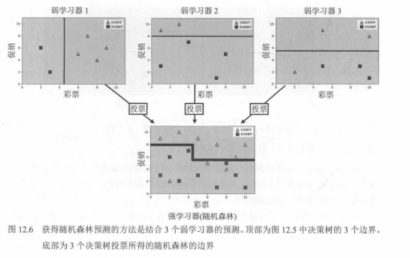
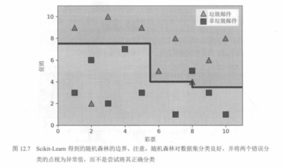
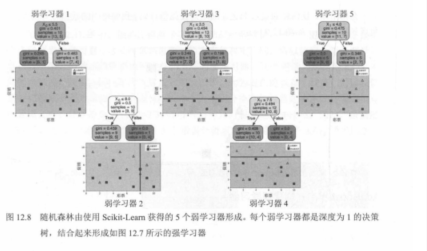
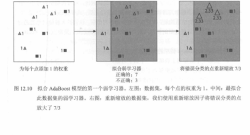

# 03. 随机森林边界与 AdaBoost 直觉（图 12.6～12.10）

本节继续 `02.Bagging与随机森林：图12.1至12.5及表12.1.md` 的例子：先看随机森林如何把多棵树的区域“拼接”成更稳健的边界（图 12.6～12.8），再进入 Boosting 的代表算法 **AdaBoost**：通过**重加权**让后续弱学习器更关注前面分错的样本（图 12.9～12.10）。

---

## 图 12.6：随机森林的“投票边界”来自多棵树边界的组合

每个弱学习器（浅树）在平面上给出一个较粗糙的分类区域；随机森林把这些区域做多数投票，得到更平滑、更稳健的整体边界（教材示意为：上方多个子学习器的边界 → 下方的综合边界）。

---

## 图 12.7：Scikit-Learn 随机森林分类器的边界示例

用 `sklearn.ensemble.RandomForestClassifier` 拟合后，得到的边界依然呈“阶梯状”（树的轴对齐切分特性），但相较单棵树通常更稳定，对局部噪声不那么敏感。

---

## 图 12.8：随机森林由多棵树组成（示例：5 棵）

教材示意：随机森林由若干棵决策树构成，每棵树深度通常受限（或经剪枝/正则），以保持“弱学习器”的特征；最终用投票/平均得到强学习器输出。

---

## 图 12.9：AdaBoost 的弱学习器集合（示意）

AdaBoost 常用非常简单的弱学习器（例如决策树桩 / 浅树）。图中每个小模型都只给出粗糙的划分，单个模型不强，但它们会被“加权组合”。

---

## 图 12.10：AdaBoost 的关键：给错分样本更高权重

AdaBoost 的训练过程（直觉版）：

- **左**：初始时所有样本权重相同。  
- **中**：训练第 1 个弱学习器，得到一个粗糙边界。  
- **右**：把被错分的点权重放大（教材示意为 7/3），让下一轮弱学习器更“在意”这些难点；多轮后加权组合成更强的整体分类器。

---

## 配图清单

| 图号 | 文件 |
|------|------|
| 12.6 | `images/fig12.6-rf-merge-boundaries.png` |
| 12.7 | `images/fig12.7-sklearn-rf-boundary.png` |
| 12.8 | `images/fig12.8-rf-5-trees.png` |
| 12.9 | `images/fig12.9-adaboost-stumps.png` |
| 12.10 | `images/fig12.10-adaboost-reweighting.png` |

下一节（AdaBoost 第二轮：更新权重与新分类器，图 12.11～12.12）：`04.AdaBoost第二轮：更新权重与新分类器：图12.11至12.12.md`

