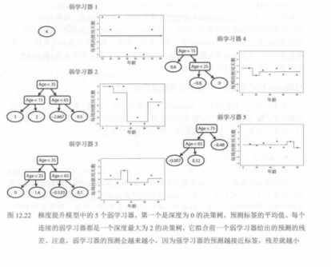

# 04. 梯度提升与 XGBoost：残差拟合到工业级优化

本节对应《机器学习图解》第 12 章后半部分，核心讲解 **Gradient Boosting（梯度提升）** 与 **XGBoost**。两者都属于传统机器学习中的 **Boosting** 路线，不是深度学习；它们的共同特征是：**串行训练多个弱学习器，并让后续模型专门修正前面模型的误差**。

---

## 一、梯度提升是什么

- **所属类别**：传统机器学习，Boosting 家族。  
- **核心逻辑**：**逐次修正误差，用残差拟合**。  
- **与 AdaBoost 的区别**：  
  - AdaBoost：通过调整样本权重，让后续模型更关注错分样本。  
  - Gradient Boosting：直接拟合上一轮的**残差**（或更一般地，损失函数的负梯度）。  

最终的强学习器，不是某一棵树，而是**所有弱学习器输出的加权和**。

---

## 二、梯度提升的图文流程

## 图 12.19：原始回归数据

教材用一个一维回归例子说明梯度提升：横轴是年龄，纵轴是某个连续目标值（例如每周使用 App 的天数）。这类数据更适合展示“预测值逐步逼近真实值”的过程。


---

## 图 12.20：一个弱学习器（浅回归树）

这里展示的是一个**浅回归树**。它会在不同区间输出不同的常数值，因此可以把复杂函数粗略地切成几段。


---

## 图 12.21：弱学习器对应的分段常数预测

把图 12.20 的树画到坐标系里，就得到一条台阶状的预测曲线。  
这条曲线当然还很粗糙，但它已经给了模型第一个“基线”。


---

## 表 12.4：预测与残差

梯度提升的关键就在这里：  

1. 先用当前模型做预测  
2. 计算残差：`真实值 - 当前预测`  
3. 再训练下一棵树去拟合这些残差  

表 12.4 正是在逐行展示这个过程。


---

## 图 12.22：多个弱学习器逐步叠加

当一棵棵浅树依次加入后，模型会逐步从粗糙走向精细。越靠后的树，通常只负责对前面模型留下的小误差做局部修正，因此它们的预测幅度也会越来越小。



---

## 三、梯度提升的训练流程

可以把它概括成 5 步：

1. **初始化**：第一个模型给出简单预测（常数或浅树）。  
2. **计算残差**：`残差 = 真实值 - 当前预测`。  
3. **拟合残差**：训练新树，专门学习残差。  
4. **加权更新**：把新树预测乘学习率，再加到总预测上。  
5. **重复迭代**：直到误差足够小或达到树数上限。  

常见超参数包括：

- `n_estimators`：弱学习器数量  
- `learning_rate`：学习率  
- `max_depth`：单棵树深度  

---

## 四、XGBoost：梯度提升的工程化强化版

**XGBoost（Extreme Gradient Boosting）** 可以理解为梯度提升的“工业级优化版”。  
它仍然属于传统机器学习，但在以下方面做了大量强化：

- **正则化**：内置 L1/L2 正则，缓解过拟合  
- **剪枝**：控制无效分裂，降低复杂度  
- **并行计算**：训练速度更快  
- **缺失值处理**：自动学习缺失值的分裂方向  
- **二阶信息**：利用一阶、二阶导数优化目标函数  

---

## 图 12.23：用增益选择最佳分裂

XGBoost 会对每个候选分裂点计算一个“增益（gain）”，选择最划算的切分。增益越大，说明这一刀越能改善当前模型。


---

## 图 12.24：剪枝与弱学习器视角

当某个分裂带来的收益太小，就会被剪掉。这样可以防止树过深、避免过拟合，也更符合 Boosting 中“弱学习器叠加”的思路。


---

## 图 12.25 与表 12.7：第二棵树与组合预测

第二棵树不是重新拟合原始标签，而是去学习第一个模型没解释好的部分；随后再把它按学习率加回总模型中。


---

## 图 12.26 与图 12.27：最终预测曲线与多轮叠加

经过多轮之后，整体模型的预测曲线会越来越贴近真实数据。  
图 12.26 展示最终输出，图 12.27 展示多个学习器是如何一步步叠加成这个结果的。


---

## 五、Python 实战

```python
from xgboost import XGBRegressor

xgb_reg = XGBRegressor(
    random_state=0,
    n_estimators=3,
    max_depth=2,
    reg_lambda=0,
    min_split_loss=1,
    learning_rate=0.7,
)

xgb_reg.fit(features, labels)
```

这段代码体现了 XGBoost 最常见的几个控制维度：

- `n_estimators`：树的数量  
- `max_depth`：每棵树能有多复杂  
- `learning_rate`：每一步修正幅度多大  
- `reg_lambda` / `min_split_loss`：控制复杂度与剪枝  

---

## 六、学习建议

如果你当前目标是理解《图解大模型》，那么这一节**不是必学前置**。  
Gradient Boosting / XGBoost 是传统机器学习里的顶级算法，但和 Transformer、注意力机制、神经网络主线是平行路线。

更准确地说：

- **对理解大模型主线几乎没有直接帮助**
- **不是当前阶段必学**
- **完全可以后补**

等你把深度学习和大模型主线吃透后，如果未来要做量化、风控、结构化数据建模或 Kaggle，再回头补这些内容会非常高效。

