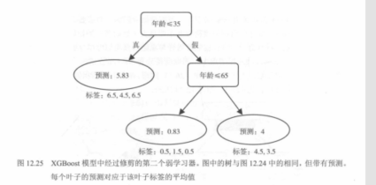

# 02. XGBoost 算法全流程详解（图 12.23～12.27，表 12.7）

本节对应《机器学习图解》第 12 章后半部分：用一个小型回归示例，把 **XGBoost（Extreme Gradient Boosting）** 的训练流程从“初始化 → 分裂准则 → 剪枝 → 迭代叠加 → 最终预测 → 代码落地”串成闭环。配图直接引用本章 `images/` 目录中已保存的截图。

---

## 一、XGBoost 是什么（定位）

- **所属类别**：Boosting 家族的**传统机器学习**算法（树模型集成），不属于深度学习。  
- **核心思想**：在梯度提升（逐轮拟合误差/残差）的基础上，做了大量工程化与正则化优化，使其在风控、推荐、Kaggle 等结构化数据任务中非常强。  

---

## 二、训练全流程（图文顺序）

### 1）初始化与第一轮：从一个简单基线开始

常见做法是先给出一个简单的初始预测（例如常数），然后计算误差/残差（或梯度信息），让后续树去做修正。

---

### 2）决策树如何选择“最佳切分”：相似度得分与分裂增益（图 12.23）

教材用“相似度得分/分裂得分”来解释：对某个节点枚举多个候选切分（例如 `Age < 35`、`Age < 65` 等），计算切分后左右子节点的得分之和，并与不切分时相比得到**增益**；选择**增益最大的切分**，意味着这一刀最“划算”。


---

### 3）剪枝（预剪枝思想）：防止过拟合（图 12.24）

当某个分裂带来的增益不足（低于阈值，例如 `min_split_loss`/`gamma`），就不值得继续分裂；剪枝让树保持“弱学习器”的属性，从而更依赖多轮叠加而不是单树记忆训练集。


---

### 4）第二棵树：拟合“修正项”并更新预测（图 12.25）

Boosting 在树上的关键：第 2 棵树不是重复拟合原始标签，而是学习当前模型还没拟合好的部分（可理解为残差/梯度方向的增量），然后把它**加到**当前预测上（通常还会乘学习率）。



---

### 5）表格验证：两轮组合预测与残差更新（表 12.7）

表中把“学习器 1 预测、学习器 2 预测、组合预测、残差”逐行列出，直观看到误差在迭代中被逐步修正。


---

### 6）最终强学习器：多棵树加权求和（图 12.27）与整体拟合效果（图 12.26）

- 多轮训练后，最终预测可视为多个弱学习器输出的加权和（含学习率）。  
- 在一维特征上，整体输出呈**台阶状曲线**；弱学习器越多，曲线越能贴合数据趋势，但也要配合学习率、正则与早停避免过拟合。


---

## 三、Python 实战：`XGBRegressor` 极简配置示例

```python
from xgboost import XGBRegressor

xgb_reg = XGBRegressor(
    random_state=0,
    n_estimators=3,      # 弱学习器数量（不含初始化项的记法依实现而定）
    max_depth=2,         # 单棵树最大深度
    reg_lambda=0,        # L2 正则（示例）
    min_split_loss=1,    # 分裂阈值/剪枝阈值（示例）
    learning_rate=0.7,   # 学习率
)

xgb_reg.fit(features, labels)
```

---

## 四、配图清单

| 编号 | 文件 |
|------|------|
| 12.23 | `images/fig12.23-xgboost-split-gain.png` |
| 12.24 | `images/fig12.24-stumps-from-tree.png` |
| 12.25 | `images/fig12.25-xgboost-second-tree.png` |
| 表 12.7 | `images/table12.7-two-learners-combined-preds.png` |
| 12.26 | `images/fig12.26-xgboost-prediction-curve.png` |
| 12.27 | `images/fig12.27-xgboost-4-learners.png` |

