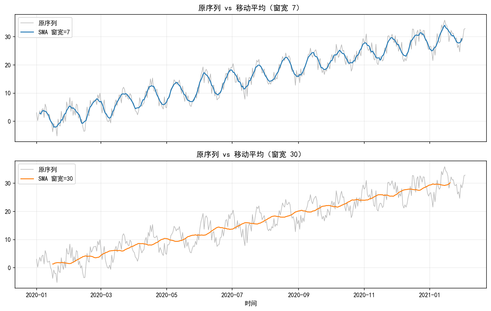
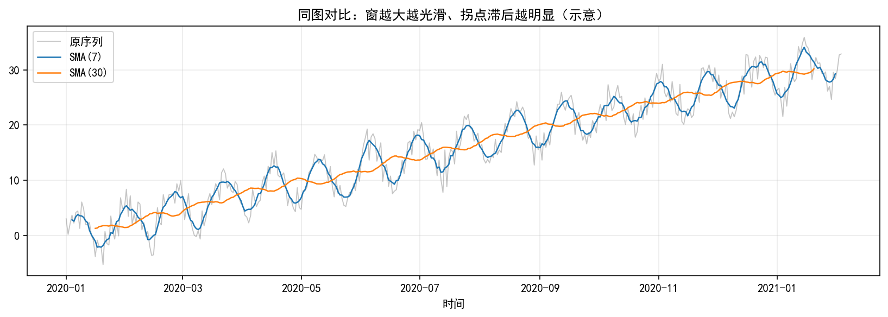

# 2.3 时间序列中的平滑

## 核心目标
掌握移动平均与指数平滑等**降噪与提信号**手段，理解滞后与分辨率之间的权衡，为趋势提取、季节调整及后续 ARIMA 直觉打基础。

---

## 一、移动平均法

### 1. 简单移动平均（SMA）
窗口内**等权**平均，实现简单、可解释性强；窗口越大曲线越光滑、**滞后**越明显。

### 2. 加权移动平均（WMA）
对窗口内各点赋权，常给**近期更大权重**，在同等窗口下可略减滞后，但需自行设定权函数。

### 3. 中心移动平均
窗口关于 t **对称**放置，利于提取周期成分、配合季节调整思路；端点处需处理边界。

---

## 二、指数平滑法

### 1. 单指数平滑（SES）
适用于**近似无趋势、无季节**的序列，等价于对过去观测作指数衰减加权。

### 2. 双指数平滑（Holt）
引入**趋势**项，适合有漂移但季节不强的序列。

### 3. 三指数平滑（Holt-Winters）
在 Holt 上再加**季节**成分，适合趋势与季节并存；季节周期需预先指定或估计。

---

## 三、平滑技术的应用与选择

1. **参数选择**：窗宽、指数平滑 alpha、季节周期等，可用交叉验证、信息准则或业务频率约束。  
2. **偏差–方差直觉**：强平滑降噪好，但易**抹平有用波动**、拐点滞后。  
3. **与 ARIMA 的联系**：指数加权思想与某些 ARMA/状态空间表示相通，后续章节可对照理解。

---

## 四、平滑示例：原序列 vs 简单移动平均（可复现）

下面用**同一条模拟序列**，对比**原序列**与 **pandas 的 rolling 简单移动平均**（SMA）。窗宽越大，曲线越光滑，但对拐点越**滞后**。

无图形界面时在仓库根目录运行：

`python TS/02_REGRESSION_EDA/eda_smooth_ma_demo.py`

会在 `TS/02_REGRESSION_EDA/img/` 生成两张图（与脚本输出一致）。

### 1）短窗 vs 长窗（分两幅子图）
上：原序列 + SMA(7)；下：原序列 + SMA(30)。  

### 2）同轴三线（看光滑度与滞后）
灰线原序列，蓝线 SMA(7)，橙线 SMA(30)。  

---

## 关键知识点总结
1. 平滑本质是**降噪**，几乎必然带来**滞后**与分辨率损失。  
2. 移动平均与指数平滑是实务中最常用的**非参数平滑**工具。  
3. 季节性强时优先考虑 **Holt-Winters** 或显式季节模型，而非盲目加长 SMA 窗宽。

---

## 对应原书信息
Shumway & Stoffer《时间序列分析及其应用》：第 2 章 2.3 节，页码 54。
